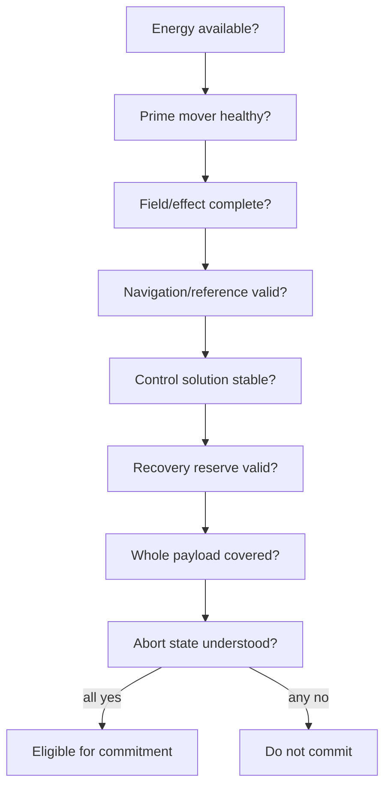
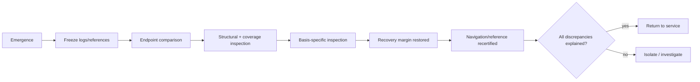

# Black Light Propulsion & Transit Field Manual

**Document class:** technical/educational presentation generated from propulsion/transit authority concepts.  
**Authority:** subordinate to `BLACK_LIGHT_PROPULSION_TRANSIT_AUTHORITY.md`, `EXO_OPERATIVE_TECHNOLOGY_BASIS.md`, the recovered FTL catalog, and machine-readable registries.  
**Canon status:** procedures are `DERIVED` training templates unless a named race, organization, manufacturer, or installation source explicitly establishes the procedure. No timing, performance threshold, consumable quantity, or failure probability in this manual should be treated as canon unless separately sourced.

---

## 1. What a technician is actually maintaining

A Black Light transit drive is not one magic engine. It is a coupled installation whose eight functions must all remain valid at the same time: energy conditioning, prime mover, field formation, transit control, navigation/sensing, termination/recovery, whole-effect coverage, and the control/thermal/abort backbone.

A fault that leaves seven blocks healthy can still make the entire transit unsafe. Navigation can invalidate perfectly functional field hardware. A healthy prime mover can be unusable because the hull no longer fits inside the certified effect boundary. A drive can enter transit successfully and still be lost if its recovery plant has insufficient reserve to terminate the effect.

The diagram is a safety logic illustration, not a canon-specific checklist order.

---

## 2. Universal status vocabulary

Operators should distinguish equipment health from transit authority.

| State | Meaning |
|---|---|
| `DORMANT` | Drive is not being prepared for transit. |
| `CONDITIONING` | Machinery is being brought into its basis-specific operating environment. |
| `CALIBRATING` | Vessel, route, references, field geometry, and recovery state are being measured. |
| `SPOOLING` | Prime mover and effect machinery are accumulating/establishing the transit state. |
| `PRECOMMIT` | Drive is ready or nearly ready; final independent constraints are being checked. |
| `ACTIVE` | Transit mechanism is committed/operating. |
| `TERMINATING` | Transit effect is being collapsed, detached, translated out, or otherwise ended. |
| `RECOVERING` | Residual energy, fields, phase state, topology, heat, or biological state is being normalized. |
| `FAULTED` | A required condition has failed or become uncertain. |
| `ISOLATED` | Drive has been placed in its family/basis-specific safe or least-dangerous isolation state. |

Abort authority is separate: `SAFE_ABORT`, `DEGRADED_ABORT`, `COMMIT_BOUNDARY`, `NO_ABORT`, `RECOVERY_ONLY`.

---

## 3. Universal pre-transit inspection — DERIVED

Before conditioning, establish what is known rather than what is expected. Verify the current authority snapshot and installation identity; vessel mass and protected-volume state; cargo and appendage configuration; structural continuity between drive foundations and hull; working-medium or basis-specific environmental state; power source, conditioning, buffer, delivery, dump, and isolation; navigation reference health; recovery capacity; current maintenance debt and unresolved faults; and the exact abort semantics of the selected transit family.

Do not clear an installation merely because yesterday's configuration was certified. The current vessel is the thing being translated, coupled, folded, embedded, or enveloped.

### 3.1 Red-tag conditions

The generic generator must block commitment when any of these conditions is unresolved: incomplete whole-effect coverage; uncertain destination exclusion where the family requires it; corrupted or unauthenticated phase/address/topology references; insufficient recovery margin; broken structural/load path; uncontrolled working-medium contamination that affects field geometry or control; unknown active fault after spool; or an unmodeled chronology-sensitive condition requiring explicit canon authority.

Named source material can add stricter prohibitions. It may not silently remove confirmed ones.

---

## 4. Basis-specific machinery identification and service

### 4.1 Terrestrial electromechanical

**What you see.** Pressure vessels, bus bars, capacitor or field stores, superconductive or high-current trunks, cryostats, coils, emitter frames, optical clocks, interferometers, pumps, heat exchangers, radiators, breakers, service cabinets, mechanical alignment structures, and conventional diagnostic ports are physically legible as machinery.

**What you service.** Electrical insulation and reference potentials; coolant purity/flow; conductor and coil condition; cryostat integrity; actuator alignment; sensor baselines; isolation breakers; pump and valve state; fasteners, bearings, supports, pressure boundaries, and structural foundations.

**Latent-failure clues.** Unexpected thermal gradients, partial discharges, quench precursors, insulation leakage, clock/reference disagreement, bearing or support vibration, field asymmetry, coolant gas formation, contamination, repeated breaker activity, or unexplained calibration drift.

**Do not assume.** A high-Path terrestrial system is maintenance-free. It can automate diagnosis, calibration, and replacement while retaining hard failure boundaries in conductors, seals, supports, cooling, isolation, and reference systems.

### 4.2 Aquatic electrochemical-hydraulic

**What you see.** Pressure-balanced chambers; immersed field surfaces; ionic/electrochemical reservoirs; hydraulic muscle or pressure-cell banks; wet optical channels; fluidic logic manifolds; membranes; distributed pressure sensors; wet-mate interfaces; and working fluid that may simultaneously be coolant, dielectric, reference medium, and actuator fluid.

**What you service.** Working-fluid chemistry, dissolved gases, osmolality, redox state, particulates, fouling, galvanic compatibility, membrane condition, pressure equalization, hydraulic valves/manifolds, wet connectors, cavitation margin, and microbial or chemical contamination where relevant.

**Latent-failure clues.** Bubbles or dissolved-gas excursions, localized pH/redox shift, pressure oscillation, unexpected acoustic modes, cavitation scars, membrane stiffness, galvanic products, foulant films, valve timing drift, or field calibration that changes with fluid composition.

**Isolation principle.** Closing a valve may be equivalent to opening a breaker only when the valve actually isolates the energy/reference carrier involved. The generator must name the physical carrier.

### 4.3 Cryogenic ammonia-halocarbon

**What you see.** Nested vacuum jackets; contraction-tolerant frames; superconductive loops; cryogenic buses; phase-change actuators; bellows/slides; soft-metal or frozen seals; photonic timing trunks; cryofluid reservoirs; and assemblies that reach correct geometry only at operating temperature.

**What you service.** Cooldown/warmup history, contraction clearances, reference geometry at temperature, cryofluid composition, vacuum quality, superconductive state, optical alignment, seal condition, trapped contamination, phase-change buffer capacity, and thermal intercepts.

**Latent-failure clues.** Warm spots, unexpected boiloff, vacuum degradation, differential contraction beyond travel, optical phase drift, superconductive transition, frozen-interface contamination, bellows distress, or geometry that is correct warm but wrong cold.

**Critical lesson.** Temperature is part of machine geometry. A warm inspection can prove the wrong thing.

### 4.4 Gas-giant fluidic-electrostatic

**What you see.** Flexible pressure shells; tension webs; buoyancy cells; charged skins; electrostatic vanes; ionic-flow channels; acoustic timing paths; pressure resonators; tethered field nodes; and large surfaces that may change shape substantially during spool.

**What you service.** Membrane permeability and fatigue; tension distribution; pressure hierarchy; charge leakage; electrostatic discharge paths; acoustic timing; ionic composition; buoyancy-cell integrity; tether attachment; and shape-reference metrology.

**Latent-failure clues.** Asymmetric inflation, standing pressure waves, tension-node creep, charge corona, unexpected ionic wind, acoustic echo distortion, membrane delamination, tether resonance, or slow shape recovery after unload.

**Critical lesson.** Shape is control state. A membrane that merely “looks inflated” may still be geometrically wrong for the field solution.

### 4.5 Biological-symbiotic

**What you see.** Field-bearing dermis; vascular heat/energy routes; specialized organs; contractile geometry-control tissues; mineralized inclusions; neural control structures; sensory ganglia; symbiont cultures; regenerative zones; and tissue boundaries that perform functions human engineers would divide among cables, pumps, sensors, actuators, and seals.

**What you service.** Nutrition, hydration/working chemistry, electrolytes, hormones, symbiont population, microbial balance, perfusion, oxygen/equivalent exchange, inflammatory/immune state, scar tissue, tumors, necrosis, neural synchronization, sensory organ health, mineralized inclusions, and regeneration reserves.

**Latent-failure clues.** Local heat, edema, color/bioluminescence change, altered metabolite output, arrhythmia-like field timing, neural desynchronization, scar-associated phase noise, abnormal growth, immune attack, exhausted regenerative tissue, or sensory disagreement before gross organ failure.

**Isolation methods.** May include vascular sphincters, neural blockade, induced dormancy, immune quarantine, apoptosis, sacrificial tissue, physical excision, or deliberate shedding where appropriate to the derived embodiment. The specific method must be generated from the installation record.

**Critical lesson.** “Self-healing” does not mean “self-certifying.” Repaired tissue must still be proven geometrically, neurologically, chemically, and functionally fit for transit.

### 4.6 Mineral piezoelectric-photonic

**What you see.** Prestressed crystalline bodies; resonant ceramic rings; oriented lattice domains; phononic cavities; photonic defect channels; catalytic inclusions; thermoelectric gradients; diffusion-bonded joints; and components whose structural and computational functions occupy the same material.

**What you service.** Crack and inclusion maps; crystallographic axes; preload; thermal-cycle history; surface quality; optical path cleanliness; polarization domains; resonant mode frequencies; diffusion bonds; permitted annealing; and regrowth interfaces.

**Latent-failure clues.** Mode splitting, polarization drift, new scattering centers, microcrack acoustic emission, optical attenuation, preload loss, domain inversion, thermal-history mismatch, or a slowly migrating resonant peak.

**Critical lesson.** Replacing a cracked crystal with a geometrically identical crystal may still be wrong if its axes, domains, preload, impurities, or optical defects are not the certified state.

### 4.7 Field-mediated postmaterial

**What you see.** Material anchor nodes, adaptive matter, programmable surfaces, distributed metrology, energy reserves, authenticated reference elements, and comparatively little correspondence between visible physical pieces and logical component boundaries.

**What you service.** Coherence state, reference-frame agreement, identity/authorization state, active topology, reserve depth, known-safe snapshots, anchor-node health, hostile-state resistance, fallback geometry, and the ability to reconstruct a materially stable safe configuration.

**Latent-failure clues.** Reference disagreement, unauthorized state mutation, coherence islands, topology drift, unexplained resource consumption, missing anchor identity, repeated self-correction, fallback reconstruction mismatch, or a subsystem that is logically present but no longer maps to a known-safe physical realization.

**Critical lesson.** The machine is not unconstrained because its boundaries are virtual. Its dangerous failure modes have shifted from broken parts to broken state.

---

## 5. Family operating notes — DERIVED from confirmed mechanism

### 5.1 Metric Compression Envelope

**Precommit question:** Can the installation close a valid envelope around the complete current payload without unacceptable horizon/radiation/recovery conditions?

**Watch during spool:** emitter geometry, hull-strain references, field symmetry, energy-store balance, clock agreement, bow-particle/radiation handling, whole-effect coverage.

**Active state:** control maintains envelope geometry against route and hull perturbation. “Speed” is secondary to whether the metric state remains valid.

**Termination:** collapse must dispose of stored field/radiation effects, prevent asymmetric closure, and return the vessel to a mechanically survivable normal state.

**Characteristic fault classes:** closure asymmetry, horizon formation, bow-radiation handling failure, ringing, field collapse.

### 5.2 Gravitational-Plane Skimmer

**Precommit question:** Is the selected gravitational/equipotential geometry valid across the planned route and current ephemeris uncertainty?

**Watch during spool/transit:** gradiometers, barycentric model, plane/ridge departure margin, inertial references, compensation-frame state.

**Termination:** leave the skim state with a survivable emergence vector and controlled differential acceleration.

**Characteristic faults:** plane loss, gravity-ridge encounter, ephemeris error, gradient overload, emergence-vector error.

### 5.3 Hyperspatial Slipstream Shear

**Precommit question:** Is a usable Q-boundary shear present, correctly mapped to normal-space correspondence, with sufficient adhesion and recovery margin?

**Watch:** Q-weather, adhesion, boundary phase, wake behavior, normal-space correspondence, phase velocity, momentum buffer.

**Termination:** match the exit to a valid normal-space state and dispose of wake/phase mismatch.

**Characteristic faults:** adhesion loss, Q-weather upset, shear excursion, phase-velocity mismatch, wake shock.

### 5.4 Q-Lattice Phase Translation

**Precommit question:** Are destination Q-address, phase epoch, state map, whole-effect coverage, and anti-aliasing checks all valid and authenticated?

**Watch:** address solution, reference clocks, protected memory, defect correction, continuity sampling, residual detectors.

**Termination/recovery:** validate the translated state, quarantine residual anomalies, preserve immutable route and continuity records.

**Characteristic faults:** address alias, epoch mismatch, corrupted reference, partial-state/coverage error, residual anomaly.

### 5.5 N-Dimensional Manifold Drive

**Precommit question:** Is there a valid embedding, axis order, higher-dimensional route, and return projection for the current vessel state?

**Watch:** topology sensors, axis references, embedding panels, geodesic solution, topology clamps, return-map integrity.

**Termination:** project back into an admissible 3+1-dimensional state without orientation/geometry failure.

**Characteristic faults:** embedding loss, axis-order error, topology trap, invalid return map, projection distortion.

### 5.6 Discrete Fold-Jump

**Precommit question:** Are both origin and destination volumes certified, empty where required, and linked by a valid adjacency solution?

**Watch before commit:** gravimetry, ranging, occupancy sensing, authenticated destination reference, aperture symmetry, energy/recoil stores.

**After commit:** assume course correction is unavailable unless a specific source says otherwise. The operating emphasis moves immediately to successful completion and recovery.

**Characteristic faults:** occupied destination, aperture asymmetry, bad adjacency solution, recoil/metric ringing, attempted abort after commit.

### 5.7 Anchored Wormhole / Gate Transit

**Precommit question:** Are both mouths correctly identified/synchronized, throat geometry stable, aperture/throughput limits respected, and scheduling/traffic state safe?

**Watch:** mouth synchronization, mass-flow asymmetry, throat stability, aperture shear, anchor power, chronology-safety interlocks.

**Recovery:** post-passage gate inspection matters even though the transiting vessel may contain little FTL hardware.

**Characteristic faults:** throat instability, asymmetric flow, mouth desynchronization, aperture shear, chronology-protection trip.

### 5.8 Quantum Phase Displacement

**Precommit question:** Is the destination state compatible and unoccupied, and are identity/reference/continuity constraints valid for all matter, software, and living occupants included in the displacement?

**Watch:** reference authenticity, state coherence, continuity records, residual-state detectors, mutable biological/software state.

**Recovery:** certify that the post-displacement vessel and occupants occupy an admissible state and isolate any residual/duplicate-state anomaly.

**Characteristic faults:** occupied target state, reference spoof, residual/duplicate anomaly, conservation mismatch, continuity-certification failure.

### 5.9 Relativistic Inertial Torch

This path is ordinary causal propulsion, not true FTL. Service priorities are thrust generation, reaction-mass/fuel delivery, exhaust/plume control, structural load path, radiation/thermal management, navigation, and crew/structure acceleration limits.

Where a reaction-mass model applies, technicians may audit mission claims with `Delta_v = v_e ln(m0/m1)`. This is a physical validation relation, not an FTL equation.

---

## 6. Recovery and post-transit inspection — DERIVED

Do not treat emergence as the end of the transit cycle. A complete cycle ends when the installation and vessel are proven capable of remaining in ordinary safe state or beginning another transit.

Preserve immutable logs first. Compare predicted and observed endpoint, momentum/orientation, reference state, field/topology/phase residuals, thermal debt, structural strain, working-medium state, and basis-specific health markers. Any unexplained residual becomes a maintenance/forensics record with provenance rather than being erased during reset.

---

## 7. Failure-response teaching model

A useful technician's question sequence is:

**What changed?** Identify observed signature or degraded quantity.  
**Which machine block owns that end effect?** Avoid chasing the most visible symptom.  
**Which route carries the required energy/control/cooling/structure/environment/access?** Trace dependencies.  
**Is the fault mechanism-specific, basis-specific, or an interface failure?** Choose the right service language.  
**Where is the commit boundary now?** Do not issue an impossible abort.  
**What evidence must be preserved?** Logs, tissue state, lattice maps, fluid chemistry, reference state, or field snapshots may be more valuable before repair than afterward.  
**What proves restoration?** Repair is not complete until the original end effect and its dependencies are restored and recertified.

---

## 8. Educational progression

### 8.1 Crew primer

Ask “what must remain true?” rather than “how fast does it go?” A drive is safe only while its route solution, complete payload coverage, machinery state, energy margin, and recovery state remain compatible with its transit mechanism.

### 8.2 Technician course

Learn the eight blocks and six utility-route semantics. Then learn your technology basis. This lets you trace a failure even when the hardware is alien: find the end effect, then identify the native carrier and interface actually responsible for it.

### 8.3 Engineering course

Treat transit as a constrained state transformation:

`S1 = T(S0, E, theta)`

The engineering installation must measure `S0` and `E`, solve `theta`, realize the transformation, bound uncertainty, preserve the complete payload, reject invalid solutions, and return to an admissible terminal state. A mathematical solution with no measurable references, controllable machinery, or recovery path is not an engineering design.

### 8.4 Intelligence-analysis course

Observe signatures by phase. A pre-entry thermal rise, gravitational distortion, Q/exotic disturbance, membrane inflation, biological metabolic shift, crystalline resonance, or postmaterial reference disturbance can reveal family/basis hypotheses. Hypotheses remain hypotheses until the evidence supports them. Do not infer the operator species or exact drive family from one familiar-looking signature.

### 8.5 Generator/API course

Every simplification shown to a player must preserve access to the underlying structured record. A UI can say “drive health 72%,” but engineering/debug views must retain which blocks are degraded, which source defined their normal state, which margins failed, and whether the displayed value is confirmed, derived, proposed, or unresolved.

---

## 9. Mathematical reference card

These equations are explanatory/validation tools unless separately adopted into Black Light canon.

**General-relativistic vocabulary**

`G_mu_nu + Lambda g_mu_nu = (8 pi G / c^4) T_mu_nu`

`ds^2 = g_mu_nu dx^mu dx^nu`

**State transformation**

`J : (x^mu, p^mu, Psi, I) -> (x'^mu, p'^mu, Psi', I')`

**Geodesic-deviation / tidal check**

`D^2 xi^mu / D tau^2 = -R^mu_(nu alpha beta) u^nu xi^alpha u^beta`

**Ordinary reaction-propulsion audit**

`Delta_v = v_e ln(m0/m1)`

**Normalized diagnostic margins**

`M_coverage = V_valid_effect / V_required_payload`

`M_recovery = recovery_available / recovery_required`

`M_power = P_available_at_drive / P_required_at_drive`

Never substitute these convenience expressions for missing canon performance values.

---

## 10. Manual-generation contract

A future software manual generator must not write procedures from scratch. It consumes the same validated installation record used by the vessel generator and renders:

- an operator quick-reference from `operations`, `navigation`, and `validation`;
- a machinery-location/identification chapter from `machineChain`, `routes`, and vessel layout;
- a service chapter from `maintenance`, basis methodology, and failure dependencies;
- an emergency chapter from `failureModes`, `abortState`, recovery, and infrastructure state;
- a signatures/diagnostics chapter from phase/channel observations;
- an educational chapter from family mechanism plus basis embodiment;
- a provenance appendix showing the authority and status of every nontrivial claim.

If the structured record says `UNRESOLVED`, the manual says unknown. It does not fill the blank because an empty page looks untidy.
