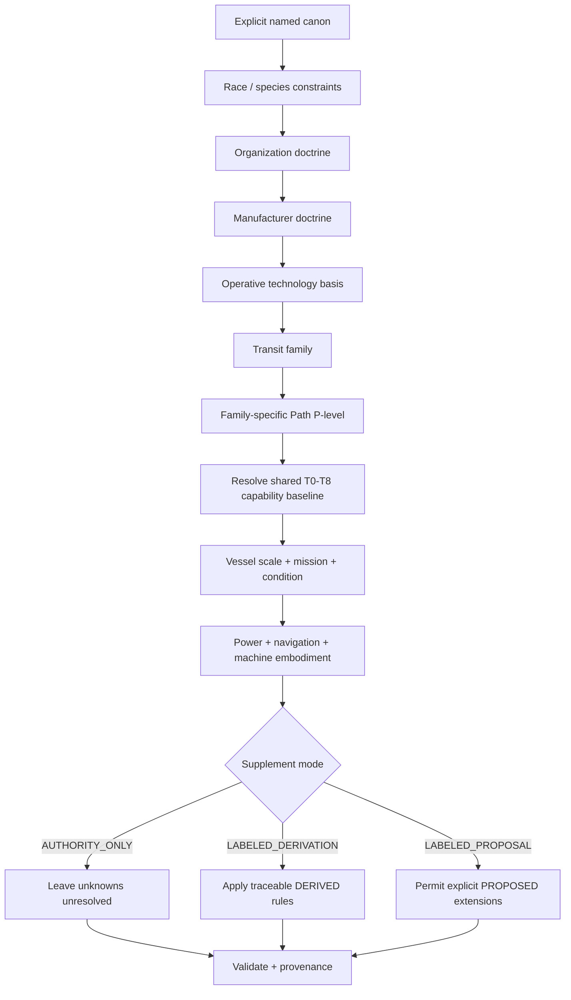
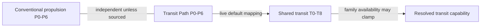
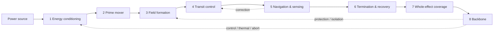
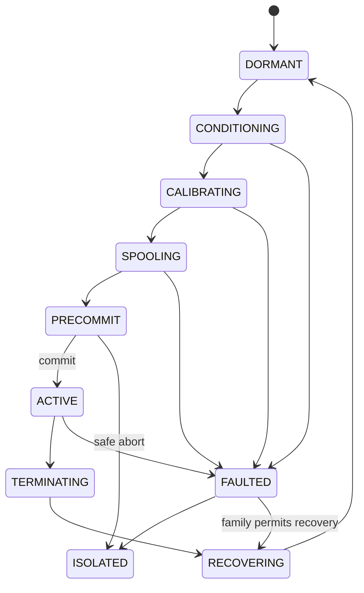
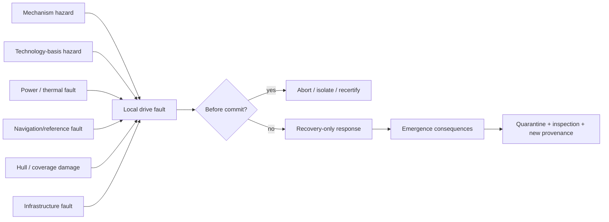
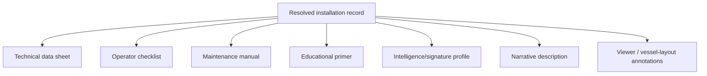

# Black Light Propulsion & Transit Generator Reference

**Role:** implementation reference subordinate to `BLACK_LIGHT_PROPULSION_TRANSIT_AUTHORITY.md`  
**Registry:** `data/exo-vessel/propulsion-transit-registry.json`  
**Schema:** `data/schemas/exo-vessel-propulsion-transit.schema.json`  
**Reconciliation basis:** repository `main` through the current propulsion/transit registry/schema integration, including the pre-existing live FTL T0-T8 capability runtime and P0-P6 Path-level runtime.  
**Canon discipline:** this document defines generator behavior. It does not promote a generated implementation, engineering analogy, or convenient extrapolation into setting-wide canon.

---

## 1. Generator objective

The generator resolves one coherent propulsion/transit installation from the same source hierarchy used by the EXO vessel system. It must be able to explain not merely what a drive is called, but what physically occupies the vessel, how power and control reach it, what a technician services, what navigation must know, how the machinery scales, what signatures it emits, how it fails, which infrastructure it depends on, and exactly which source or rule justified every nontrivial output.

The authoritative resolution order is:



A lower-priority layer may specialize a higher-priority value but may not contradict it. A generated result that cannot explain its parent inputs and resolver rule is incomplete.

The conventional-propulsion P-band is resolved separately. It is not part of the FTL Path-to-Tier chain.

---

## 2. Authority snapshot and immutability

Every generation begins by freezing an `authoritySnapshot`. The minimum record is repository, branch, source commit, propulsion/transit authority path, registry version, generator id/version, and seed. This snapshot is part of the generated vessel record and travels with exported manuals, intelligence reports, and narrative views.

The generator treats source classes differently:

| Source state | Generator behavior |
|---|---|
| Confirmed named value | Copy or specialize only where the source explicitly permits specialization. Never replace. |
| Confirmed lower bound/classification | Preserve the bound/classification and label any model refinement separately. |
| Confirmed live runtime rule | Preserve the current generator relationship until deliberately migrated; do not restate it differently in a second data table. |
| Candidate/disputed | Keep segregated from confirmed totals or conclusions. |
| Explicit unknown | Keep unknown in `AUTHORITY_ONLY`; derive only in `LABELED_DERIVATION`; propose only in `LABELED_PROPOSAL`. |
| Derived value | Preserve parent inputs, resolver rule, and status. |
| Proposed value | Never silently promote through repeated generation or documentation. |

This mirrors the existing Blacklight EXO published-first provenance doctrine: procedural material fills permitted gaps; it does not overwrite source authority.

---

## 3. Three scale coordinates, two different P vocabularies

The reconciled project contains **three distinct scale coordinates**. Two happen to use P0-P6 labels, while the live shared FTL capability model uses T0-T8.



### 3.1 Conventional propulsion P0-P6

`conventionalPropulsion.technologyBand` comes from `data/exo-vessel/engineering-registry.json`. It describes ordinary-spacetime propulsion technology and remains independent of FTL unless a specific civilization/source establishes a relationship.

| Band | Ordinary-space propulsion | Exhaust velocity | Base strategic delta-v |
|---|---|---:|---:|
| P0 | Pulsed fission thermal | 25 km/s | 6 km/s |
| P1 | Fusion thermal | 80 km/s | 18 km/s |
| P2 | Fusion plasma | 250 km/s | 50 km/s |
| P3 | Advanced fusion torch | 900 km/s | 140 km/s |
| P4 | Aneutronic fusion torch | 3,000 km/s | 400 km/s |
| P5 | Antimatter-catalyzed plasma | 12,000 km/s | 1,400 km/s |
| P6 | Field-coupled relativistic torch | 45,000 km/s | 5,000 km/s |

These values are ordinary-space registry inputs. They are not FTL speed classes.

### 3.2 Family-specific Transit Path P0-P6

`transit.pathLevelKey` is the live Path maturity/implementation coordinate from `blacklight-exo-ftl-path-level-core.js`:

| Runtime key | Display | Engineering meaning |
|---|---|---|
| `p0` | Path 0 · Monumental Precursor | planetary/lunar/deep-orbit monolith; narrow windows; industrial-grid burden |
| `p1` | Path 1 · Industrial Demonstrator | fixed industrial array; replaceable sectors; inspection/recalibration between activations |
| `p2` | Path 2 · Fixed Operational System | repeatable orbital/anchored infrastructure; strategic single-point dependence |
| `p3` | Path 3 · Capital-Scale Mobile Prototype | capital/tender/mobile-ring scale independent machinery |
| `p4` | Path 4 · Fleet Operational Standard | repeatable fleet/commercial architecture with route surveys and industrial support |
| `p5` | Path 5 · Compact Strategic System | compact automated shipboard systems; less forgiving thermal/damage margins |
| `p6` | Path 6 · Mature Path Apex | fighter-scale through self-regulating strategic implementations; remaining risks shift toward causality, identity, interference, and topology |

This level is more than a construction-size adjective in the current runtime. It also carries family-specific performance range, charge/recovery window, energy multiplier, reliability/error factors, and utility/limitation records. Those detailed arrays stay in the live Path definition files until the runtime itself is deliberately migrated to a unified data registry.

### 3.3 Shared transit capability T0-T8

`transit.sharedCapabilityTierKey` is the live cross-family capability/performance envelope from `blacklight-exo-ftl-physics-definitions.js`:

| Runtime key | Shared capability label |
|---|---|
| `t0` | Relativistic Precursor |
| `t1` | Near-Light Compression |
| `t2` | Supra-Light Prototype |
| `t3` | System-Jump Capability |
| `t4` | Operational Interstellar Drive |
| `t5` | Strategic Corridor Drive |
| `t6` | Deep-Range Manifold Drive |
| `t7` | Compact Multisystem Drive |
| `t8` | Post-Material Transit Architecture |

This tier is a shared comparison/performance framework used by the base generator. It does not replace a family-specific Path level.

### 3.4 Canonical live coupling

The current Path runtime defines:

`STAGE_TO_TIER = [0, 1, 2, 3, 4, 6, 8]`

Therefore the default mapping is:

| Path | Shared tier baseline |
|---|---|
| P0 | T0 |
| P1 | T1 |
| P2 | T2 |
| P3 | T3 |
| P4 | T4 |
| P5 | T6 |
| P6 | T8 |

When the caller explicitly requests a Path level, the Path controller sets the shared tier baseline from that mapping. If a selected family cannot operate at that shared tier, family availability may clamp the shared tier into its certified runtime window. If the caller also requested a contradictory T-tier, the Path level wins and the correction is recorded in compatibility/provenance.

The generator MUST NOT collapse any of the three coordinates into `techLevel`, `pathLevel`, or `P-level` without its domain. A report that says merely “P5 technology” is ambiguous and invalid.

---

## 4. Transit-family resolution

The registry exposes nine recovered families. Eight are true FTL/nonlocal transit mechanisms; `inertial-torch` remains a causal ordinary-space precursor/comparison path.

| Key | Family | Resolution quantity that matters most |
|---|---|---|
| `metric-envelope` | Metric Compression Envelope | envelope geometry, closure, horizon/radiation margin |
| `gravitic-plane` | Gravitational-Plane Skimmer | geodesic/equipotential solution and gradient margin |
| `slipstream-shear` | Hyperspatial Slipstream Shear | Q-boundary adhesion, Q-weather, correspondence state |
| `q-lattice` | Q-Lattice Phase Translation | address + epoch validity and whole-state coverage |
| `n-manifold` | N-Dimensional Manifold Drive | embedding, axis order, higher-dimensional route and return map |
| `fold-jump` | Discrete Fold-Jump | origin/destination exclusion and adjacency solution |
| `wormhole-gate` | Anchored Wormhole / Gate Transit | mouth identity, synchronization, aperture stability, throughput |
| `phase-displacement` | Quantum Phase Displacement | compatible state, occupation exclusion, continuity/reference validity |
| `inertial-torch` | Relativistic Inertial Torch | thrust, reaction mass, delta-v, thermal/acceleration limits |

Generic user words such as `warp`, `jump`, `gate`, `hyperspace`, or `teleport` are search terms, not final family identifiers. The resolver must map them to a confirmed family only when other inputs make that mapping defensible; otherwise it returns a choice set or `UNRESOLVED`.

---

## 5. Eight-block machine construction

Every transit installation must resolve all eight end effects:



Each block emits the same record shape: end effect, physical embodiment, carrier, control method, service method, dependencies, failure modes, and canon status. Empty prose such as “advanced alien machinery” is invalid. The generator may leave an embodiment unresolved, but it must say so rather than invent one.

### 5.1 Technology-basis embodiment rule

The eight functions are invariant. Their machinery language comes from `EXO_OPERATIVE_TECHNOLOGY_BASIS.md` and `technology-basis-registry.json`.

| Basis | Typical carrier/control language | Service logic |
|---|---|---|
| Terrestrial electromechanical | conductors, fields, electronics/photonic timing, pumps, actuators, cryostats | isolate, inspect, calibrate, replace, flush, electrically test |
| Aquatic electrochemical-hydraulic | ionic potential, immersed electrochemistry, pressure logic, hydraulic actuation, wet optical channels | chemistry sampling, fouling removal, seal/valve service, pressure equalization |
| Cryogenic ammonia-halocarbon | superconductive/cold buses, cryofluid, photonic timing, phase-change actuation | cooldown geometry, contamination control, seal integrity, contraction/alignment checks |
| Gas-giant fluidic-electrostatic | pressure gradients, charged membranes, electrostatic/ionic flow, acoustic/fluidic logic | membrane/tension repair, pressure balance, charge/reference tuning |
| Biological symbiotic | metabolism, bioelectric/ionic routes, neural/hormonal control, grown field tissues | feeding, husbandry, surgery, grafting, immune/microbiome regulation, regeneration |
| Mineral piezoelectric-photonic | stress, polarization, phonons, photons, resonant lattice states | flaw mapping, preload restoration, cleaning optical paths, annealing, regrowth |
| Field-mediated postmaterial | persistent controlled states, adaptive matter, distributed references | coherence/reference restoration, authorization audit, fallback reconstruction |

A basis never exists merely to rename human parts. If the service procedure, failure vocabulary, route interfaces, physical shape, and control assumptions remain human after changing the label, the embodiment resolver has failed.

---

## 6. Race/species constraints before technology stereotypes

Species-specific source records outrank generic basis defaults. A species record can narrow a basis without proving a transit mechanism.

### 6.1 Ar'nock test case

The surviving foundation record confirms biological fabrication, cultivated neural computation, vibration-based controls, flexible interfaces compatible with elongated segmented reach, unfamiliar identity controls, and a survivable but chemically nonhuman atmosphere. These facts are valid constraints on an Ar'nock-derived machinery record.

They do **not** establish an Ar'nock FTL family. Therefore a canon-safe Ar'nock result may say:

```json
{
  "species": "Ar'nock",
  "confirmedEngineeringConstraints": [
    "cultivated neural computation",
    "vibration-based controls",
    "biological fabrication",
    "flexible interface geometry"
  ],
  "transitFamily": null,
  "transitFamilyStatus": "UNRESOLVED"
}
```

In `LABELED_DERIVATION` mode the generator may derive, for example, that service interfaces should accommodate cultivated tissue and vibration feedback. It may not decide that the Ar'nock use a Q-Lattice drive simply because such a drive combines well with cultivated computation.

---

## 7. Scaling model

Scale changes embodiment, redundancy, geometry, and maintenance burden. It does not by itself change technological identity.

Recovered scale bands remain the primary buckets: probe, fighter/strike craft, shuttle/courier, corvette, frigate/merchant, cruiser, capital/carrier, and gatework/megastructure.

Path level changes which implementation scale is plausible and, in the live runtime, also changes the family-specific performance/reliability envelope. Shared T-tier provides a cross-family capability envelope. Neither should be inferred from vessel mass alone when the caller or source already supplies them.

### 7.1 Non-canon engineering burden estimator

For design comparison only:

`B_effect = k_family * M^alpha * V_effect^beta * C_geometry * C_environment * C_damage`

`B_effect` is engineering burden, not joules or a canonical cost. `M` is translated/coupled mass, `V_effect` is required protected volume, and correction factors account for shape, environment, and damaged condition. `alpha`, `beta`, and `k_family` remain uncalibrated until Black Light canon supplies numbers.

Useful normalized margins are:

`M_coverage = V_valid_effect / V_required_payload`

`M_recovery = E_or_capacity_recovery_available / E_or_capacity_recovery_required`

`M_power = P_available_at_drive / P_required_at_drive`

A value below 1 means the represented requirement is not met. These are generator diagnostics, not canonical performance laws.

### 7.2 Family-specific scaling pressure

Continuous-coverage systems (`metric-envelope`, `slipstream-shear`) grow increasingly sensitive to surface/volume geometry and distributed field coherence. State/volume systems (`q-lattice`, `phase-displacement`, `fold-jump`) grow increasingly sensitive to complete payload/state definition, exclusion checks, address/reference integrity, and synchronized coverage. `n-manifold` adds topology and axis-solution complexity. Gate systems shift much of the burden into aperture, throughput, anchor stability, and infrastructure rather than onboard machinery. `gravitic-plane` couples scaling to mass distribution, reference geometry, and gradient control.

These are `DERIVED` engineering consequences of the confirmed mechanisms, not extra canon statistics.

---

## 8. Power and thermal generation

Power plant and transit family are independent dimensions. The recovered archive permits fusion pulse banks, antimatter-catalyzed field plants, micro-singularity accumulators, metastable vacuum-polarization cells, Q-state condensate reservoirs, and direct stellar power/mass taps for fixed gateworks where the path permits them.

Every generated energy architecture resolves:

`source -> conditioning -> buffer/storage -> delivery -> drive block -> recovery/dump -> emergency isolation`

A record with a reactor but no delivery, isolation, heat handling, or recovery path is incomplete.

For ordinary-space reaction propulsion, a physical validation view may use the classical rocket equation where applicable:

`Delta_v = v_e * ln(m_0 / m_1)`

This is a real-physics audit tool for compatible reaction-mass architectures; it is not a formula for FTL range or speed and must never be applied to nonreaction transit simply because the vessel record contains a delta-v field.

A generic thermal accounting check is:

`Q_dot_reject >= Q_dot_waste_power + Q_dot_drive_residual + Q_dot_environment - Q_dot_stored`

The terms and efficiencies are `DERIVED/PROPOSED` until a specific installation supplies them. The invariant is simpler: heat or equivalent rejected disorder must have an identified carrier, store, sink, radiating/exchange surface, biological route, lattice route, or field-state management method.

---

## 9. Navigation generation

Navigation is resolved after family selection because the required state is mechanism-specific. The generator fills `navigation.referenceModel`, `requiredInputs`, `solutionStatus`, uncertainty, and provenance.

A useful abstract state is:

`S_1 = T(S_0, E, theta)`

where `S_0` is measured initial vessel state, `E` is measured route/environment/reference state, `theta` is the solved control set, and `S_1` is an admissible terminal state. A route solver must demonstrate that it measured or bounded the values needed to construct `theta`; a perfect destination coordinate is not sufficient.

Endpoint uncertainty may be carried as covariance `Sigma_endpoint`. A normalized navigation confidence can be exposed for UI purposes as:

`C_nav = 1 - clamp(trace(W * Sigma_endpoint), 0, 1)`

`W` and acceptance thresholds remain `PROPOSED` until calibrated. Raw uncertainty and provenance must be retained even if the UI shows a simple confidence bar.

---

## 10. Controls and operators

`operatorModel` is not assumed human. It may be bridge-directed, specialist navigator, distributed automation, bonded organism, collective biological sensing, resonant crystalline controller/caste, gate traffic control, or field-mediated authenticated state control when supported by source and basis.

All operators interact with a common state machine:



The separate abort vocabulary is `SAFE_ABORT -> DEGRADED_ABORT -> COMMIT_BOUNDARY -> NO_ABORT -> RECOVERY_ONLY`. Each family maps its physical point-of-no-return onto that vocabulary; the generator must not invent one universal emergency-stop behavior.

---

## 11. Signatures

Generate signatures across four phases rather than one vessel-wide number: pre-entry/spool, active transit, emergence/termination, aftermath/recovery. Candidate channels are electromagnetic, thermal, optical, gravitational, neutrino, Q/exotic, acoustic/structural, chemical, and biological.

Every signature entry records phase, channel, strength class, geometry, duration, detectability, persistence, status, and provenance. `strengthClass` may remain contextual or unresolved where canon does not provide a scale.

Basis affects the observable path. Biological drives can produce metabolic, chemical, thermal, neurological, or tissue-state signatures; mineral drives can produce phononic, polarization, luminescent, fracture, and resonance effects; postmaterial systems can show coherence/reference disturbances. None is assumed signatureless merely because it is unfamiliar.

---

## 12. Failure generation and propagation

Failure is the Cartesian product of mechanism, basis, integration, vessel condition, environment, navigation state, power margin, coverage margin, recovery margin, and any external infrastructure state.

A descriptive risk relation is:

`risk = f(mechanismState, technologyHealth, environment, navigationConfidence, energyMargin, coverageIntegrity, recoveryMargin)`

No universal numerical probability is implied.



Mechanism failure lists come from the recovered archive/authority. Basis failure lists come from the operative-technology source. Integration failures are derived only where a concrete interface exists: e.g. a correct power connector with an incompatible reference potential, a pressure-balanced module connected to a dry service bay, or a biological control channel translated without identity/authentication semantics.

---

## 13. Maintenance generation

Maintenance is generated from the same block and route records, never as generic flavor text. The minimum output contains inspection triggers, calibration references, consumables/working media, life-limited elements, degradation indicators, recertification triggers, emergency isolation, depot/manufacturer-only tasks, and service environment.

The generator also creates a dependency-preserving service order:

1. make the installation safe and identify current abort/commit state;
2. preserve logs and reference state before mutation;
3. isolate hazardous energy/working media or living/field equivalents;
4. inspect basis-specific latent damage;
5. repair the authoritative failed component/route rather than masking its symptom;
6. restore calibration and coverage;
7. perform low-energy or low-authority functional proof;
8. recertify navigation references, recovery margin, and emergency isolation;
9. record changed parts/tissue/lattice/state and provenance.

Specific manufacturer procedures may override this order where canon explicitly says so.

---

## 14. Infrastructure model

Infrastructure is a configuration layer, not a ninth or tenth FTL physics family.


The diagram is an increasing-infrastructure illustration, not a mandatory technology progression. A culture may specialize early in gateworks or reject corridors entirely.

Each infrastructure record states external dependencies, route authority, throughput constraints if known, service dependencies, political-control consequences if supported, and canon status. Gate scheduling, beacon custody, corridor surveying, maintenance depots, customs chokepoints, military interdiction, and monopoly are strategic consequences to derive only where the infrastructure exists.

---

## 15. Provenance construction

Every nontrivial generated field receives a provenance entry:

```json
{
  "field": "machineChain.fieldFormation.embodiment",
  "status": "DERIVED",
  "sourcePath": "EXO_OPERATIVE_TECHNOLOGY_BASIS.md",
  "sourceRevision": "<blob or commit>",
  "resolverRule": "basis-plus-family-embodiment",
  "parentInputs": ["identity.technologyBasis","transit.family","vessel.scaleClass"],
  "notes": "Physical embodiment derived without changing the confirmed transit mechanism."
}
```

Path/T-tier resolution receives its own provenance rather than disappearing into a generic maturity number:

```json
{
  "field": "transit.sharedCapabilityTierKey",
  "status": "CONFIRMED",
  "sourcePath": "blacklight-exo-ftl-path-level-runtime.js",
  "resolverRule": "STAGE_TO_TIER then family-window clamp",
  "parentInputs": ["transit.pathLevelKey","transit.family"],
  "notes": "Explicit Path level controls the shared capability baseline in the live runtime."
}
```

Provenance belongs to the value, not merely to the overall document. A mixed result can therefore contain confirmed family identity, confirmed live runtime scale resolution, derived machinery embodiment, proposed scaling coefficients, and unresolved manufacturer procedure without flattening everything to one confidence label.

---

## 16. Multi-view output contract

One resolved structured installation is the source for every presentation. No view is allowed to regenerate lore independently.



The technical view emphasizes fields and margins. The operator view exposes prerequisites, current state, prohibited actions, abort semantics, and recovery. The maintenance view expands service methods and dependencies. The educational view explains mechanism and machinery in audience-appropriate language. The intelligence view exposes signatures, infrastructure, observed behavior, and confidence. The narrative view may use evocative language but cannot contradict the structured record.

---

## 17. Validation invariants

A generated installation is invalid if any of these fail:

1. Conventional propulsion P-band, Transit Path P-level, and shared transit T-tier are merged, mislabeled, or lose their coupling provenance.
2. An explicit Path level is overwritten by a contradictory shared T-tier instead of resolving the T-tier from the live Path mapping and family window.
3. A confirmed source value or live runtime constraint is overwritten by a procedural value.
4. A derived/proposed value lacks provenance and parent inputs.
5. A transit installation omits any of the eight machine blocks without explicitly marking that block unresolved.
6. Any of the six EXO route semantics lacks carrier/interface/tolerance state.
7. Whole-effect coverage does not include the intended payload or does not report the shortfall.
8. Navigation inputs do not match the selected transit mechanism.
9. The physical layout cannot provide a structural/load path between drive foundations, hull, and required reaction/field forces.
10. Energy delivery has no isolation/recovery/dump path.
11. Abort behavior ignores the family-specific commit boundary.
12. A race-specific FTL family is invented from generic technology-basis compatibility.
13. An alien interface is declared `DIRECT` merely because the end effect is recognizable.
14. A generated chronology effect appears without explicit canon authority.
15. A generated manual or narrative contradicts the structured installation record.
16. Re-running with identical source snapshot, complete seed hierarchy, resolver inputs, and generator version produces a different authoritative result without a recorded nondeterministic input.

---

## 18. Implementation sequence

The software integration sequence is:

`propulsion-transit-registry.json -> species/org/manufacturer authority -> exo-vessel technology-basis record -> conventional propulsion band -> transit family -> Path P-level -> Path-to-T-tier resolver -> vessel scale/mission/condition -> machine/routes/navigation/power/failure/maintenance resolver -> schema validation -> presentation views`.

Until migration is complete, the live T0-T8 performance tables remain authoritative for generator behavior in `blacklight-exo-ftl-physics-definitions.js`, and the detailed P0-P6 Path tables remain in the Path definition/runtime files. The registry records their relationship without duplicating their detailed numeric arrays.

Do not duplicate the transit-family list in renderer code. Do not encode Ar'nock drive choice in presentation code. Do not let the viewer decide which provenance wins. Authority is resolved once; views display the resolved result.