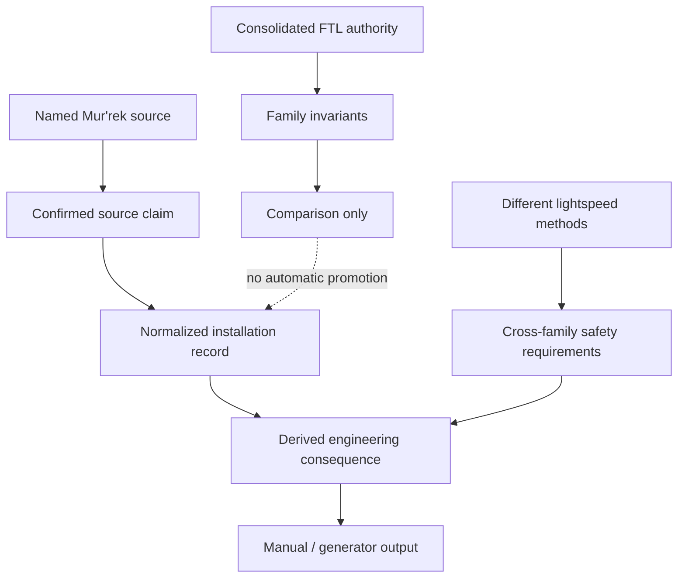
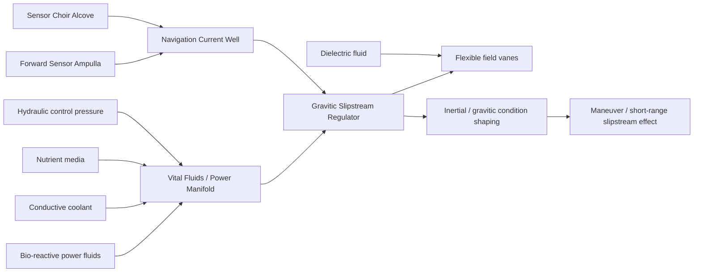
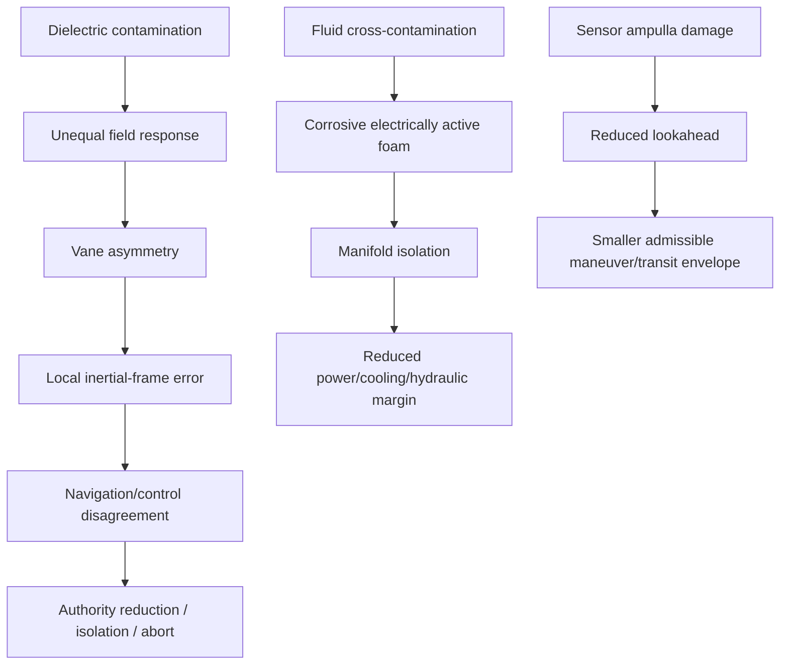
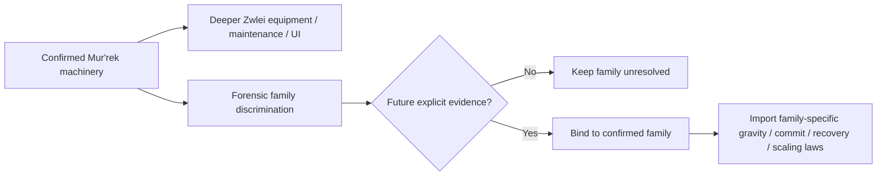

# Zwlei Mur'rek Propulsion & Transit Engineering Manual

**Status:** `MIXED` — confirmed named-vessel/class facts plus explicitly labeled engineering derivation.  
**Subject:** Zwlei Frog Men, Mur'rek-class patrol frigate.  
**Primary named source:** `blacklight-archive-zwlei-murrek-no-return-signal-derelict.html`.  
**Consolidated authority:** `docs/blacklight/BLACK_LIGHT_PROPULSION_TRANSIT_AUTHORITY.md`.  
**Machine-readable companion:** `data/exo-vessel/zwlei-murrek-transit-engineering-registry.json`.  
**Validation contract:** `data/schemas/exo-vessel-zwlei-murrek-transit-engineering.schema.json`.  
**Planning source:** Google Drive document **The different lightspeed methods**, document ID `1e0Xp71EFubBZgXWjjvPxAqPoJIZNwqS6nu1-r7Kil7Y`.  

---

## 1. Why this manual exists

The Mur'rek-class record is the first current Black Light source in this propulsion/transit workstream to provide a named alien vessel class with a concrete, unusually specific transit-adjacent machinery description:

> **bio-reactive gravitic slipstream system**

The same source names a **Gravitic Slipstream Regulator** built from flexible field vanes immersed in dielectric fluid, a **Navigation Current Well** that expresses course solutions as moving currents, a **Vital Fluids / Power Manifold**, a **Forward Sensor Ampulla**, and a multisensor **Sensor Choir Alcove**.

Those are high-value engineering facts. They are also exactly the kind of facts that a generator can damage by trying too hard to normalize terminology.

The Black Light consolidated transit authority currently distinguishes **Gravitational-Plane Skimmer** from **Hyperspatial Slipstream Shear** as separate physical operators. The Mur'rek source uses both *gravitic* and *slipstream* vocabulary without explicitly stating which consolidated operator is present.

Therefore this manual adopts the following firewall:

\[
\boxed{
\text{source terminology}
\neq
\text{automatic family normalization}
}
\]

The class has a confirmed **gravitic slipstream installation**. Its exact mapping to the consolidated FTL-family key remains **UNRESOLVED** until a source explicitly establishes that relation.

That is not a weakness in the corpus. It is the correct representation of the evidence.

---

## 2. Authority and provenance

### 2.1 Precedence

For this class, use the following order:

1. Specific Mur'rek-class and named-vessel source material.
2. Explicit family/operator canon if a future source maps the installation to a family.
3. `BLACK_LIGHT_PROPULSION_TRANSIT_AUTHORITY.md`.
4. Civilization-engineering and cross-family integration doctrine.
5. Labeled engineering derivation.
6. Labeled proposal.

A generic generator may not overwrite the named source merely because another family template looks cleaner.

### 2.2 Claim graph



A generated engineering explanation must retain enough ancestry to answer:

- Which statement came directly from the Mur'rek source?
- Which statement came from the general FTL corpus?
- Which statement is derived from both?
- Which statement is merely proposed for future development?

### 2.3 Provenance completeness

For published generated material, reuse the corpus-wide derived editorial metric:

\[
C_P=
\frac{N_{\rm claims\ with\ source+status+transform}}
     {N_{\rm externally\ asserted\ claims}}.
\]

Target:

\[
C_P=1.
\]

This is an editorial/provenance metric, not an in-universe physical measurement.

---

## 3. Confirmed Mur'rek installation facts

### 3.1 Vessel and mission

**CONFIRMED** source facts include:

- Mur'rek-class Zwlei patrol frigate.
- Warm, humid, wet-deck mixed atmosphere.
- Shallow circulation channels.
- Rounded living-polymer composite over flexible synthetic load frames.
- Reconnaissance, border monitoring, ecological observation, diplomacy, and controlled defensive withdrawal doctrine.
- Non-FTL cruise and station keeping optimized for low signature.
- Bio-reactive gravitic slipstream system.

### 3.2 Gravitic Slipstream Regulator

**CONFIRMED:** flexible field vanes immersed in dielectric fluid shape inertial and gravitic conditions for efficient maneuvering and short-range slipstream operation.

**CONFIRMED hazard:** asymmetric vane response can rotate the local inertial frame.

This is unusually useful because it gives us not merely a system name but a physically interpretable actuator, working medium, control objective, and named failure consequence.

### 3.3 Navigation Current Well

**CONFIRMED:** course solutions appear as moving currents whose speed, depth, and interference encode:

- vector,
- gravity,
- transit risk.

The same station explicitly performs:

- gravitic reference,
- slipstream prediction,
- inertial control.

This is not a decorative alien UI. It is a distinct control representation for a multidimensional navigation state.

### 3.4 Vital Fluids / Power Manifold

**CONFIRMED:** the manifold distributes:

- conductive coolant,
- bio-reactive power fluids,
- nutrient media,
- hydraulic control pressure.

**CONFIRMED hazard:** mixed fluids can create corrosive electrically active foam.

This means Mur'rek propulsion/transit readiness cannot be reduced to stored electrical power. The machine is a coupled field/fluid/biological installation.

### 3.5 Sensor architecture

**CONFIRMED:** the Sensor Choir Alcove fuses electromagnetic, gravitic, chemical, acoustic, and exotic observations.

**CONFIRMED:** the Forward Sensor Ampulla uses clear gel and organic transducers for long-baseline observation, target ranging, spectroscopy, and passive listening.

**CONFIRMED hazard:** the ampulla is comparatively fragile and isolates first under fire.

That source fact has direct safety consequences: loss of forward sensing can collapse the admissible transit/maneuver envelope long before propulsion machinery itself fails.

---

## 4. The terminology problem: gravitic slipstream is not yet a family key

The current consolidated Black Light corpus contains at least two families whose vocabulary overlaps the Mur'rek phrase.

| Candidate comparison | Confirmed family operator | Why comparison is relevant | Why assignment is not yet allowed |
|---|---|---|---|
| Gravitational-Plane Skimmer | geodesic/equipotential-plane transit with gradient correction | Mur'rek machinery explicitly shapes gravitic and inertial conditions | source does not say it rides interstellar gravitational planes or focal-node shear lanes |
| Hyperspatial Slipstream Shear | Q-space boundary-layer/shear coupling | source explicitly says slipstream prediction and short-range slipstream operation | source does not explicitly mention Q-space, boundary adhesion, shear-layer coupling, or detachment |
| Installation-local hybrid control | gravitic control supporting some other transit operator | field vanes may condition entry, stability, steering, or exit around another effect | source does not separate prime mover from regulator |
| Local/non-FTL slipstream usage | class-local terminology | source explicitly distinguishes non-FTL cruise and short-range slipstream operation | source does not establish interstellar range or true-FTL performance |

The correct state is therefore:

\[
\boxed{F_{\rm Murrek}=\mathrm{UNRESOLVED}}
\]

while simultaneously:

\[
\boxed{
I_{\rm gravitic\ slipstream}=\mathrm{CONFIRMED}
}
\]

Those two statements are compatible.

---

## 5. Physical embodiment

### 5.1 System architecture



This architecture should be rendered as a **wet, coupled, stateful machine** rather than a terrestrial engine room translated into biological vocabulary.

### 5.2 Readiness vector

A useful **DERIVED** state vector is:

\[
\mathbf R_M=
[
 m_v,
 m_d,
 m_p,
 m_c,
 m_h,
 m_n,
 m_s,
 m_g,
 m_i,
 m_{str}
]^T,
\]

where:

- \(m_v\): vane geometry/compliance margin,
- \(m_d\): dielectric-medium margin,
- \(m_p\): bio-reactive power-fluid margin,
- \(m_c\): coolant margin,
- \(m_h\): hydraulic-control margin,
- \(m_n\): nutrient/metabolic support margin,
- \(m_s\): sensor margin,
- \(m_g\): gravitic-reference margin,
- \(m_i\): inertial-reference margin,
- \(m_{str}\): structural alignment/load margin.

An admissible high-authority operating state requires:

\[
A_{op}=\bigwedge_i(m_i>0).
\]

This is deliberately an AND condition.

A full power reservoir cannot compensate for bad gravitic reference. Healthy biological tissue cannot compensate for contaminated dielectric medium. Perfect navigation cannot compensate for vane asymmetry.

---

## 6. Power and working media

### 6.1 Multi-resource power model

A simple **DERIVED** readiness ratio is:

\[
R_P=
\min\left(
\frac{P_{bio}}{P_{req}},
\frac{Q_{cool}}{Q_{req}},
\frac{H_{hyd}}{H_{req}},
\frac{N_{met}}{N_{req}}
\right).
\]

This is not a recovered Zwlei equation. It is an engineering representation of what the confirmed source already implies: several resource classes are simultaneously required.

### 6.2 Why one power number is misleading

A terrestrial generator might be tempted to produce:

`drivePower = 83%`

That is insufficient.

A Mur'rek installation can plausibly have:

- adequate energy density,
- inadequate coolant circulation,
- normal nutrient chemistry,
- degraded hydraulic authority,
- contaminated dielectric fluid,
- partially functional field vanes.

The resulting machine is not “83% operational.” It has a particular feasible envelope.

### 6.3 Protected reserve

Until the exact consolidated family is resolved, the class should inherit the general safety rule:

\[
R_{available}=R_{total}-R_{protected}>0.
\]

The physical content of `protected` remains installation-specific and partly unresolved. It may include sufficient fluidic, power, control, and field authority to collapse or unwind a partially established effect, restore a safe inertial state, isolate a divergent vane sector, or complete a controlled de-transit process.

Do not spend the final protected reserve merely to improve range or speed.

---

## 7. Navigation and gravity

The planning document **The different lightspeed methods** explicitly requires different transit mechanisms to receive different gravity coefficients, efficiency-loss behavior, prediction burdens, and emergency safety responses.

The Mur'rek source gives us an ideal named-vessel embodiment of that requirement without giving us permission to invent the final coefficients.

### 7.1 Navigation state

A **DERIVED** control-state abstraction is:

\[
\mathbf x_{nav}=
[
\mathbf r,
\mathbf v,
\mathbf g,
\nabla\mathbf g,
\Sigma_s,
\Sigma_m,
\mathbf u_v,
\mathbf q_f
]^T,
\]

where:

- \(\mathbf r\): position estimate,
- \(\mathbf v\): velocity/inertial state,
- \(\mathbf g\): local gravity estimate,
- \(\nabla\mathbf g\): gravity-gradient estimate,
- \(\Sigma_s\): sensor covariance,
- \(\Sigma_m\): model covariance,
- \(\mathbf u_v\): vane-command state,
- \(\mathbf q_f\): working-fluid state.

### 7.2 Current-well representation

The source says vector, gravity, and transit risk are encoded through moving currents whose **speed**, **depth**, and **interference** vary.

A canon-safe rendering layer may therefore map a solved navigation state into a visual/haptic field:

\[
\mathcal C:
\mathbf x_{nav}
\rightarrow
\{v_c,d_c,I_c\},
\]

where:

- \(v_c\) is displayed-current speed,
- \(d_c\) is displayed-current depth,
- \(I_c\) is interference structure.

The exact encoding transform remains `UNRESOLVED` unless a source specifies it.

### 7.3 Gravity cost placeholder

Because the exact family is unresolved, the correct gravity law is not yet:

\[
C_g = k\,|\nabla\Phi|^n.
\]

Instead retain the functional placeholder:

\[
C_{g,M}=F_M(
\Phi,
\nabla\Phi,
H(\Phi),
\mathrm{shear},
\Sigma_s,
\Sigma_m,
A_{vane}
).
\]

The coefficients and exponent structure remain unresolved until the family/operator mapping is established.

This preserves the planning document's requirement without manufacturing canon.

---

## 8. Control system

### 8.1 Distributed authority

Mur'rek control should not be modeled as one throttle.

A useful **DERIVED** control vector is:

\[
\mathbf u_M=
[
\mathbf u_{vane},
\mathbf u_{hyd},
\mathbf u_{fluid},
\mathbf u_{inertial},
\mathbf u_{grav},
\mathbf u_{isolation}
]^T.
\]

The command basin, Navigation Current Well, regulator, and manifold together form a distributed state-control architecture.

### 8.2 Vane symmetry

Define a **DERIVED** weighted mismatch:

\[
\epsilon_v=
\|\mathbf u_{cmd}-\mathbf u_{obs}\|_W.
\]

Then a conservative operating rule is:

\[
\epsilon_v\ge\epsilon_{abort}
\Rightarrow
\text{leave high-authority operation}.
\]

The threshold is not canonically quantified.

The physical basis is, however, source-supported: asymmetric vane response can rotate the local inertial frame.

### 8.3 Control observability

The corpus-wide rule applies cleanly here:

\[
\boxed{
\text{loss of hazard observability}
\Rightarrow
\text{reduce authority or abort}
}
\]

unless an independently validated guard channel remains available.

A failed Forward Sensor Ampulla is therefore not merely a sensor-repair issue. It can be a propulsion/transit-envelope limitation.

---

## 9. Maintenance doctrine

The following procedures are **DERIVED from confirmed machinery**, not claimed as recovered Zwlei regulations.

### 9.1 Field-vane inspection

Inspect:

- vane shape,
- flexible compliance,
- mounting alignment,
- dielectric exposure,
- local fluid stagnation,
- biofilm or repair-film overgrowth,
- actuator/hydraulic response,
- response symmetry under low-authority stimulation.

A repaired flexible vane must be recertified geometrically and dynamically.

### 9.2 Dielectric-fluid maintenance

Measure:

- dielectric strength,
- ionic contamination,
- dissolved metabolic products,
- suspended repair material,
- conductive-fluid ingress,
- temperature dependence,
- bubble or phase separation,
- electrical/field response under low stress.

### 9.3 Vital-fluid separation

Because the source explicitly identifies corrosive electrically active foam as a mixed-fluid hazard, cross-contamination procedures must treat the event as simultaneously:

- chemistry failure,
- corrosion event,
- electrical hazard,
- field-coupling hazard,
- contamination of calibration state,
- possible biological-support casualty.

### 9.4 Navigation-current calibration

Do not calibrate the Current Well solely against itself.

Use independent reference channels where available:

1. inertial reference,
2. gravitic reference,
3. forward sensor baseline,
4. Sensor Choir fused solution,
5. known static calibration target,
6. low-authority vane response.

A visually smooth current display can still encode a wrong solution if all upstream references share the same defect.

---

## 10. Signature model

The source confirms low-signature optimization for non-FTL cruise and station keeping. It does not establish zero signature, and it does not establish the signature of undocumented long-range transit.

A useful **DERIVED** signature vector is:

\[
\mathbf S_M=
[
S_{EM},
S_{thermal},
S_{grav},
S_{chem},
S_{acoustic},
S_{subspace},
S_{wake},
S_{bio}
]^T.
\]

### 10.1 Likely observables by source-supported embodiment

| Channel | Source basis | Engineering interpretation |
|---|---|---|
| electromagnetic | sensor and power systems exist | regulator/manifold activity may create measurable electrical transients |
| thermal | coolant and active fluid systems exist | heat must be moved even if the vessel suppresses external signature |
| gravitic | regulator explicitly shapes gravitic conditions | local modulation is a plausible observation target |
| chemical | wet-deck and active fluid machinery | leaks/venting can carry installation-state evidence |
| acoustic/vibratory | pressure-regulated wet machinery | internal operating state may be diagnosable acoustically |
| subspace | communications bladder explicitly supports subspace communications | communications signature must not be confused with propulsion signature |
| wake | unresolved | only emit if the eventual family/operator supports it |
| biological | bio-reactive machinery | metabolic activity can reveal machinery condition without revealing the FTL family |

### 10.2 Stealth safeguard

Never infer:

`low-signature cruise -> invisible FTL`.

That inference is unsupported.

---

## 11. Failure model

### 11.1 Confirmed failure anchors

The named source gives three especially valuable failure anchors:

1. asymmetric vane response can rotate the local inertial frame;
2. mixed vital fluids can create corrosive electrically active foam;
3. the Forward Sensor Ampulla is comparatively fragile and isolates first under fire.

### 11.2 Derived failure tree



### 11.3 Risk is not just failure probability

Use the corpus-wide engineering form:

\[
R_{risk}=P_{fail}\,C_{consequence}\,X_{recoverability}.
\]

A rare asymmetric-vane event can still dominate operational planning if it has severe consequences and weak recoverability.

---

## 12. Scaling behavior

The Mur'rek installation should not scale linearly with vessel mass.

A **DERIVED** burden model is:

\[
B_M=F(
A_{vane},
V_{protected},
L_{reference},
Q_{fluid},
M_{ship},
\tau_{response},
\sigma_{alignment},
\mathcal G_{env}
).
\]

Where:

- \(A_{vane}\): total active vane area,
- \(V_{protected}\): volume whose inertial/gravitic state must remain coherent,
- \(L_{reference}\): sensor/reference baseline,
- \(Q_{fluid}\): working-fluid flow/conditioning burden,
- \(M_{ship}\): vessel mass,
- \(\tau_{response}\): required regulator response time,
- \(\sigma_{alignment}\): allowable vane/reference misalignment,
- \(\mathcal G_{env}\): local gravity/shear environment.

### 12.1 Why larger is harder

A larger installation can require:

- greater vane area,
- longer fluid runs,
- greater pressure-control volume,
- more complex sector synchronization,
- larger protected structural span,
- longer sensor baselines,
- more stringent timing consistency,
- greater fault isolation complexity,
- higher recovery reserve.

No canon numeric exponent is presently established.

---

## 13. Infrastructure

The named source establishes an onboard installation but does **not** establish:

- external slipstream beacons,
- gravity-lane traffic control,
- interstellar corridor infrastructure,
- gate infrastructure,
- special Zwlei service yards,
- manufacturer-specific calibration facilities,
- range-extension stations.

All remain `UNRESOLVED`.

A generator may propose such systems only in `LABELED_PROPOSAL` mode.

---

## 14. Practical equipment manual

### MR-01 — Regulator Pre-Operation Certification

**Purpose:** establish that the Mur'rek regulator is safe for increasing field authority.

**Procedure:**

1. Verify compartment pressure, wet-deck chemistry, and isolation state.
2. Independently sample dielectric, coolant, bio-reactive power fluid, nutrient medium, and hydraulic medium.
3. Survey vane geometry, flexible compliance, and mounting alignment.
4. Verify gravitic and inertial references against independent sensor channels.
5. Exercise each vane sector at minimal authority.
6. Measure commanded-versus-observed response and cross-sector symmetry.
7. Confirm manifold isolation can separate a failed sector.
8. Confirm sufficient protected reserve for recovery.
9. Compare Navigation Current Well output with independent sensor fusion.
10. Increase authority only inside the verified envelope.

**Reject operation if:**

- any fluid class is cross-contaminated beyond certified limits,
- vane response cannot be independently observed,
- gravitic and inertial references disagree beyond the certified envelope,
- protected recovery reserve is unavailable,
- a sector cannot be isolated,
- forward sensing is inadequate for the requested operating authority.

---

### MR-02 — Asymmetric Vane Response

**Trigger:** observed response diverges from commanded response or inertial-frame rotation exceeds expected behavior.

**Procedure:**

1. Stop increasing field authority.
2. Compare independent inertial references.
3. Identify divergent vane sector(s).
4. Isolate command and fluid feeds to the divergent sector where safe.
5. Reduce toward the last verified symmetric state.
6. Treat frame rotation as a navigation and structural casualty, not merely efficiency loss.
7. Inspect dielectric condition, vane compliance, hydraulic response, and reference alignment.
8. Recalibrate after repair.
9. Do not return to high-authority operation until symmetry is recertified.

---

### MR-03 — Vital-Fluids Cross-Contamination

**Trigger:** fluid chemistry, conductivity, color, foam, pressure, or sensor readings indicate mixing between normally separated service media.

**Procedure:**

1. Isolate affected manifold branch.
2. Remove unnecessary electrical/field authority.
3. Preserve a sample before flushing.
4. Identify involved media.
5. Treat foam as potentially conductive and corrosive.
6. Inspect downstream vanes, membranes, coolant passages, and sensor-reference hardware.
7. Flush and restore one media class at a time.
8. Establish new chemistry and dielectric baselines.
9. Recalibrate any affected field or navigation subsystem.

---

### MR-04 — Derelict Regulator Survey

**Purpose:** investigate an abandoned Mur'rek without assuming dormant machinery is safe.

**Procedure:**

1. Acquire passive gravitic, electromagnetic, thermal, chemical, acoustic, and exotic baselines.
2. Map trapped pressure and surviving fluid volumes.
3. Do not open membranes before pressure and chemistry are bounded.
4. Trace regulator feeds and isolation boundaries without energization.
5. Record vane geometry before moving or sampling anything.
6. Treat surviving Current Well states as historical residue, not live course solutions.
7. Record event epoch before energization, breach, sample removal, or repair.
8. Export observations into the evidence-instance chain.
9. Do not auto-select an FTL family.

---

### MR-05 — Sensor-Loss Operating Envelope

**Purpose:** recalculate safe authority after partial loss of forward sensing.

1. Identify which sensor channels remain independent.
2. Determine lookahead horizon and covariance growth.
3. Remove operating modes whose required hazard-detection horizon exceeds surviving sensing.
4. Reduce maneuver/transit authority before attempting to compensate with prediction alone.
5. Treat model-only lookahead as a degraded mode, not equivalent to direct sensing.
6. Restore independent forward sensing before returning to the prior envelope.

A generic derived condition is:

\[
T_{sense}\ge
T_{detect}+T_{validate}+T_{command}+T_{actuate}+T_{safe}+T_{margin}.
\]

The actual terms and thresholds remain installation/family-specific.

---

## 15. Educational text: undergraduate module

### 15.1 Learning objective

Students should be able to explain why the phrase “gravitic slipstream” does not authorize family assignment while still permitting detailed engineering analysis.

### 15.2 Exercise

Given the following observations:

- flexible field vanes in dielectric fluid,
- gravitic reference,
- slipstream prediction,
- local inertial-frame rotation under asymmetric response,
- no confirmed Q-space measurement,
- no confirmed interstellar gravity-plane route map,

answer:

1. Which facts are confirmed?
2. Which family comparisons are reasonable?
3. Which additional observation would most strongly discriminate between Gravitational-Plane and Slipstream-Shear?
4. Which conclusions remain unresolved?

### 15.3 Correct reasoning pattern

A strong answer distinguishes **machine embodiment** from **operator physics**.

Possible discriminators include:

- Q-space boundary adhesion or detachment evidence,
- persistent shear/wake signatures,
- explicit gravitic focal-node route data,
- equipotential/geodesic route locking,
- family-specific commit and recovery semantics.

The correct conclusion with current evidence is still:

\[
F_{Murrek}=UNRESOLVED.
\]

---

## 16. Advanced course: inverse identification

Treat the family as a latent variable \(F\) and observations as \(E\).

A conceptual engineering classifier may compare:

\[
P^*(F|E)
\propto
P(E|F)P(F),
\]

but the output is **hypothesis ranking**, not canon probability.

If the evidence channels are correlated, use a covariance-aware score rather than counting observations:

\[
S_f\propto
\mathbf l_f^T\Sigma_E^{-1}\mathbf e.
\]

Again, this is `PROPOSED` forensic mathematics, not recovered Zwlei science.

The purpose is to avoid errors such as counting:

- three displays driven by one controller,
- two translated logs copied from one archive block,
- several residues caused by one casualty,

as independent confirmations.

---

## 17. Research and thesis directions

The following are **PROPOSED** academic directions for the Black Light corpus.

### 17.1 Field-vane symmetry under fluid-property drift

Study the relation between dielectric chemistry, flexible-vane compliance, hydraulic response, and inertial-frame error.

Candidate research relation:

\[
\delta\mathbf a_{frame}
=
J_v\delta\mathbf u_v
+J_d\delta\mathbf q_d
+J_h\delta\mathbf q_h.
\]

### 17.2 Alien navigation representation and operator cognition

Study whether moving-current representations are merely display semantics or an integrated computational substrate in Zwlei command systems.

### 17.3 Multimodal hazard prediction

Investigate how gravitic, acoustic, chemical, electromagnetic, exotic, and forward optical/spectroscopic channels are fused when a vessel approaches its operating limits.

### 17.4 Wet-machine common-mode failure

Study common-mode failures where one contamination event simultaneously degrades power, cooling, hydraulic control, and field stability.

---

## 18. Patent-class development examples

These are **PROPOSED** technology classes. They are not historical Zwlei patents and do not establish inventors or dates.

### 18.1 Self-referencing vane metrology membrane

A thin sensor layer bonded to each flexible field vane continuously measures local strain, curvature, dielectric boundary state, and hydraulic response.

### 18.2 Fluid-isolation chromatographic gate

A living or synthetic membrane identifies cross-contaminants before allowing a working fluid into a critical regulator branch.

### 18.3 Independent gravitic guard ampulla

A small, physically separate gravitic sensor provides abort-only data even if the primary Forward Sensor Ampulla or Sensor Choir loses coherence.

### 18.4 Current-well provenance overlay

Navigation display currents carry visible provenance markers showing which parts of the solution originate from direct sensing, prediction, archive route data, or degraded estimates.

---

## 19. Generator contract

The resolver is:

`resolveZwleiMurrekTransitEngineering(context)`

### 19.1 AUTHORITY_ONLY

May emit:

- `bio-reactive gravitic slipstream system`,
- Gravitic Slipstream Regulator,
- flexible field vanes,
- dielectric fluid,
- Navigation Current Well,
- gravitic reference,
- slipstream prediction,
- inertial control,
- confirmed sensor systems,
- confirmed fluid systems,
- confirmed hazards,
- confirmed mission/environment facts.

Must emit:

`familyResolution.status = UNRESOLVED`

unless a newer higher-authority source explicitly resolves it.

### 19.2 LABELED_DERIVATION

May additionally emit:

- readiness vectors,
- fluidic-field architecture,
- maintenance procedures,
- scaling burdens,
- control models,
- failure propagation,
- signature channels,
- gravity-cost placeholders,
- evidence requirements.

Every such value must remain labeled `DERIVED`.

### 19.3 LABELED_PROPOSAL

May additionally produce:

- advanced regulator generations,
- training accidents,
- academic theses,
- patent-class devices,
- retrofit programs,
- hypothetical infrastructure.

But it may not invent canonically binding:

- manufacturer,
- inventor,
- date,
- first-use history,
- civilization-wide prevalence,
- interstellar range,
- consolidated family assignment.

---

## 20. API shape

Illustrative output:

```json
{
  "subject": "Mur'rek-class patrol frigate",
  "sourceTerm": "bio-reactive gravitic slipstream system",
  "sourceStatus": "CONFIRMED",
  "familyResolution": {
    "status": "UNRESOLVED",
    "comparisons": ["slipstream-shear", "gravitic-plane"]
  },
  "machinery": {
    "confirmed": [
      "Gravitic Slipstream Regulator",
      "flexible field vanes",
      "dielectric fluid",
      "Navigation Current Well"
    ],
    "derived": [
      "coupled fluidic-field readiness model"
    ]
  },
  "canonWarnings": [
    "Do not normalize family by keyword."
  ]
}
```

---

## 21. Canon safeguards

1. Preserve the exact named-source term **bio-reactive gravitic slipstream system**.
2. Do not normalize `gravitic` to `gravitic-plane` by keyword.
3. Do not normalize `slipstream` to `slipstream-shear` by keyword.
4. Do not infer an inventor or manufacturer.
5. Do not infer interstellar range from short-range slipstream operation.
6. Do not generalize low-signature non-FTL cruise into invisible FTL.
7. Do not turn a derelict-specific observation into intact-class behavior without separate evidence.
8. Do not count generated documentation as independent confirmation of its own derived statements.
9. Do not turn a proposed patent, thesis, training accident, or retrofit into history.
10. Do not erase a future contradiction; preserve it until scope/revision/authority resolves it.
11. If future named canon explicitly maps the drive to a consolidated family, promote only that mapping and then recompute family-specific safety/scaling rules from the higher authority.
12. Preserve the original wording even after a mapping is established, because the Zwlei source term may remain culturally and technically meaningful.

---

## 22. Integration with the wider propulsion/transit corpus

This manual adds something the generic family volumes cannot: a named alien installation whose physical embodiment is already partially known.

That means future work can proceed in two directions at once without conflating them:



Until that explicit evidence exists, the corpus should become **more detailed without becoming more certain than its sources**.

That is the intended Black Light standard.
