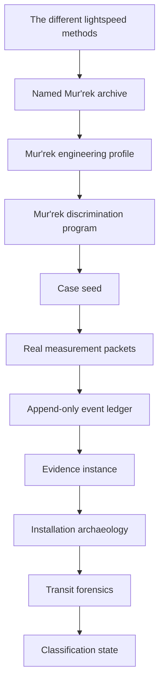
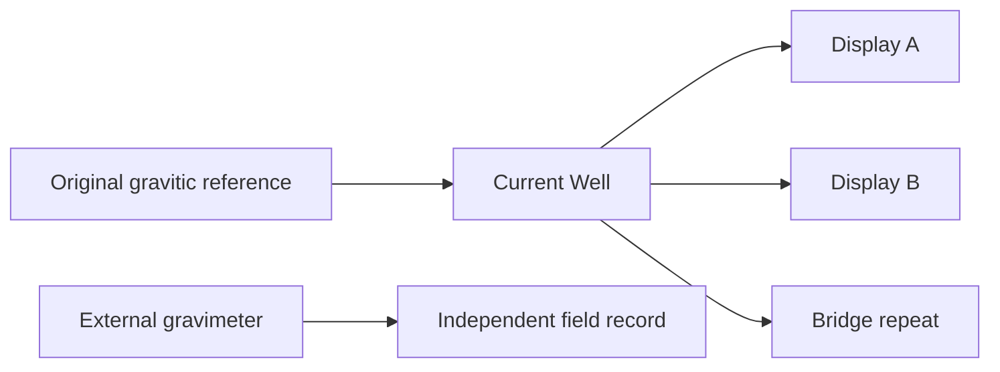

# Zwlei Mur'rek Transit Case Seed & Survey Manual

**Status:** `MIXED` — CONFIRMED Mur'rek source assertions plus DERIVED investigation, measurement, event, and teaching doctrine.  
**Subject:** No Return Signal Mur'rek-class patrol-frigate derelict.  
**Consolidated FTL family:** `UNRESOLVED`.  
**Machine-readable companion:** `data/exo-vessel/zwlei-murrek-transit-case-seed.json`.  
**Validation contract:** `data/schemas/exo-vessel-zwlei-murrek-transit-case-seed.schema.json`.  
**Design source:** Google Drive document **The different lightspeed methods**, document `1e0Xp71EFubBZgXWjjvPxAqPoJIZNwqS6nu1-r7Kil7Y`, revision `ANLCKQllC5h6dLaX5H1RpK8aUFVWsi-IV7gbMHUd0Qq7mIe5uGsLFi5_Hrsr8B6dl8t_ezB0fTSygxrnIBtifAHW79bgSbswp1zF3NaEil0`.

---

## 1. Purpose

The Mur'rek engineering corpus now has a confirmed named installation, a race/vessel engineering profile, a family-discrimination program, family-neutral measurement doctrine, evidence-instance rules, installation archaeology, forensic classification, and deterministic event replay. What it lacked was the durable case boundary between **what the archive already says** and **what investigators have actually observed**.

This manual closes that gap.

The governing rule is:

\[
\boxed{\text{source assertion}\neq\text{field observation}\neq\text{derived interpretation}}
\]

A source can establish that an intact Mur'rek uses flexible field vanes in dielectric fluid. It cannot establish that the derelict's vane fluid is still present, charged, uncontaminated, connected, calibrated, or even accessible.

The case therefore begins in:

`SOURCE_SEEDED__NO_FIELD_MEASUREMENTS`

rather than pretending that the archive itself was a survey instrument.

---

## 2. Authority and provenance chain



The source order is intentionally asymmetric. A later generated measurement record may refine the **condition of this derelict**, but it cannot rewrite the historical fact that the source calls the machinery a *Gravitic Slipstream Regulator*. Conversely, that source-local name cannot dictate a consolidated family classification before operator evidence exists.

### 2.1 Canon labels

| Label | Meaning in this case |
|---|---|
| `CONFIRMED` | Explicitly stated by the named Mur'rek source or higher authority. |
| `DERIVED` | Engineering consequence constrained by confirmed facts. |
| `PROPOSED` | Useful research, equipment, or method not yet adopted as setting fact. |
| `UNRESOLVED` | Evidence is insufficient to decide. |
| `MIXED` | Record contains fields of more than one authority class. |

---

## 3. What the archive actually gives us

The named derelict archive confirms the following transit-relevant architecture:

| Compartment | Confirmed baseline role | Current case use |
|---|---|---|
| Navigation Current Well | gravitic reference, slipstream prediction, inertial control | reference ancestry, route semantics, historical telemetry |
| Sensor Choir Alcove | electromagnetic, gravitic, chemical, acoustic, exotic fusion | sensor-root and covariance archaeology |
| Vital Fluids / Power Manifold | coolant, bio-reactive power fluid, nutrient media, hydraulic control | service topology and contamination hazards |
| Mission Planning / Ancestral Archive | archive access and mission simulation | route history and terminology provenance |
| Forward Sensor Ampulla | long-baseline observation, ranging, spectroscopy, passive listening | safety-lookahead and damage-survivability study |
| Gravitic Slipstream Regulator | flexible field vanes in dielectric fluid; inertial/gravitic shaping; short-range slipstream | principal machinery-under-test |
| Bio-Reactive Power Reservoir | principal energy medium, reserve storage, load leveling | energy and recovery-capacity archaeology |

The archive also confirms two hazards relevant to transit investigation:

1. mixed vital fluids may form corrosive electrically active foam;
2. asymmetric vane response may rotate the local inertial frame.

Neither hazard identifies an FTL family.

---

## 4. The case starts with zero fabricated measurements

The initial packet `MRK-M000` has:

```text
observed = false
values = {}
status = NOT_OBSERVED
```

This is deliberate. It prevents a generator from treating absence of data as zero-valued telemetry.

The distinction is fundamental:

\[
\boxed{\text{not measured}\neq 0}
\]

and

\[
\boxed{\text{below resolution}\neq 0}
\]

and

\[
\boxed{\text{destroyed sensor}\neq\text{negative observation}}
\]

Any later measurement packet must state what was measured, with which instrument instance, during which causal epoch, against which calibration and clock ancestry, over what spatial coverage, and with what uncertainty and damage assumptions.

---

## 5. Measurement state vector

A practical Mur'rek transit survey should preserve a multichannel state rather than a single generic anomaly score.

A DERIVED survey vector is:

\[
\mathbf y_M=
[
 g,\nabla g,\dot g,
 q,
 \tau,
 e,
 T,
 p,
 \chi,
 a,
 b,
 s
]^T
\]

where:

- \(g,\nabla g,\dot g\): gravitic field, gradient, and temporal change;
- \(q\): Q/boundary-state proxy channel;
- \(\tau\): topology/metric residual channel;
- \(e\): electromagnetic state;
- \(T\): thermal state;
- \(p\): pressure/hydraulic state;
- \(\chi\): chemistry and fluid identity;
- \(a\): acoustic/vibratory state;
- \(b\): biological activity;
- \(s\): structural strain/alignment state.

The measurement model remains:

\[
\mathbf y=H(\mathbf x)+\mathbf b+\mathbf n+\mathbf c
\]

with calibrated bias \(\mathbf b\), stochastic noise \(\mathbf n\), and contamination/unmodelled coupling \(\mathbf c\).

No term is assigned a fictional number merely because the schema can store one.

---

## 6. Uncertainty budget

Every real packet should preserve the decomposed uncertainty set:

\[
\mathcal U=
\{\Sigma_{random},\Sigma_{cal},\Sigma_{clock},\Sigma_{reg},\Sigma_{damage},\Sigma_{model},\Sigma_{contam}\}.
\]

This is especially important aboard the Mur'rek because apparently different observations can share hidden ancestry through:

- one Navigation Current Well reference;
- one Sensor Choir fusion root;
- one historical calibration table;
- one damaged archive block;
- one translation model;
- one biological service network.

For a transformed result:

\[
\Sigma_z\approx J\Sigma_xJ^T+\Sigma_{instr}+\Sigma_{model}.
\]

If two channels share a reference error, their agreement is not independent confirmation.

---

## 7. Provenance-independent evidence

The discrimination program requires multiple independent operator-level discriminator groups before provisional family promotion.

That makes independence a physical and documentary question, not a count of files.

### Bad counting

```text
Current Well display A ─┐
Current Well display B ─┼─ same reconstructed gravitic reference
Bridge repeat display ──┘

three displays ≠ three independent measurements
```

### Better ancestry model



Only the external gravimeter becomes a new provenance root if its calibration and clock are genuinely independent.

---

## 8. Negative evidence

The current engineering corpus uses the detectability form:

\[
A^- = I\,V\,R\,B\,S\,(1-D)
\]

where:

- \(I\): instrument capability;
- \(V\): observed volume/coverage;
- \(R\): resolution adequacy;
- \(B\): valid bandwidth/dynamic range;
- \(S\): expected marker survival;
- \(D\): probability that damage erased or invalidated the marker.

A missing boundary-state signature in a destroyed regulator is weak evidence. A missing signature in an intact, fully covered, high-resolution, unsaturated and independently calibrated volume can become meaningful.

This is one of the central safeguards demanded by the design source's emphasis on transit miscalculation, safety margins, and drive-specific failure modes.

---

## 9. Survey epochs

The Mur'rek case must be divided by intervention boundaries.

```text
E0  archive-only baseline
 |
 | passive entry / no physical change
 v
E1  untouched physical survey
 |
 | sampling / access breach
 v
E2  post-access state
 |
 | bounded energization
 v
E3  post-stimulation state
 |
 | repair / regrowth
 v
E4  altered geometry requiring recertification
```

A later condition cannot be back-projected into E1 without a reconstruction model.

The general comparison is:

\[
\Delta y=y_{post}-M(y_{pre},\Delta t,\mathcal E)
\]

where \(M\) represents expected passive evolution between epochs.

---

## 10. Instrument-instance doctrine

The case registry seeds six DERIVED external instrument instances. These are investigation functions, not historical Zwlei products.

### MRK-I01 — Passive multi-channel field recorder

Use for synchronized baseline acquisition. It must record saturation and dropouts rather than silently flattening them.

### MRK-I02 — Gravitimetric gradient array

Use for local field, gradient, tidal, shear and vane-induced response. Its reference must be independent of the Current Well.

### MRK-I03 — Service-network tracer

Use for power, dielectric, coolant, nutrient, hydraulic, timing, data, structural and field connections. Trace injection must remain below any level capable of waking an unknown controller.

### MRK-I04 — Reference/clock ancestry analyzer

Use to identify common clocks, repeated records, shared calibration tables and reconstructed reference dependencies.

### MRK-I05 — Chemical-biological residue analyzer

Use to characterize fluids, dielectric, tissue and contamination. Chemistry may constrain function but cannot identify a transit family by itself.

### MRK-I06 — Low-authority stimulus rig

Locked by default. It is not admitted until passive evidence, chemistry, vane geometry, abort authority and safe-envelope intersection have all been verified.

---

## 11. Unknown-family active testing

For admissible hypotheses \(H\), the allowed active envelope is:

\[
\mathcal A_{unknown}\subseteq\bigcap_{h\in H}\mathcal A_h.
\]

If that intersection is empty or not demonstrated, active testing stops.

Information gain never overrides survivability.

A proposed test utility is:

\[
U_T=\frac{IG(T)}{1+\lambda_hH_T+\lambda_cC_T+\lambda_sS_T+\lambda_dD_T+\lambda_rR_T}.
\]

Here hazard, contamination, emitted signature, destructive cost and recovery burden penalize a test even when it could be highly informative.

---

## 12. Abort engineering

Abortability is not a button. It is a timing proof:

\[
T_{abort}\ge
 t_{detect}+t_{validate}+t_{command}+t_{actuate}+t_{decay}+t_{margin}.
\]

The Mur'rek source's confirmed inertial-frame rotation hazard makes this especially important.

A second invariant is mandatory:

\[
\boxed{\text{loss of hazard observability}\Rightarrow\text{abort}}
\]

unless an independently validated guard channel remains available.

Sensor saturation, clock desynchronization, fluid-state ambiguity, vane-position uncertainty or loss of structural registration all count as loss of observability when they conceal the hazard variable being controlled.

---

## 13. Protected recovery authority

The test program must reserve recovery energy and actuator authority:

\[
R_{available,test}=R_{total}-R_{protected}>0.
\]

For an unresolved Mur'rek mechanism we do not yet know whether the essential recovery action resembles Slipstream detachment, Gravitational-Plane recoupling, closure of a separate hybrid operator, or merely return to a stable local inertial state.

Therefore recovery reserve is kept generic until evidence earns a more specific interpretation.

---

## 14. Mur'rek wet-machine readiness

For the known installation embodiment, high-authority readiness should remain multidimensional:

\[
R_P=
\min\left(
\frac{P_{bio}}{P_{req}},
\frac{Q_{cool}}{Q_{req}},
\frac{H_{hyd}}{H_{req}},
\frac{N_{met}}{N_{req}},
\frac{D_{diel}}{D_{req}}
\right).
\]

This says nothing about exact performance coefficients. It says that five distinct support domains can independently veto operation.

A powerful bio-reactive reservoir cannot compensate for a failed dielectric environment or unusable hydraulic vane authority.

---

## 15. Vane asymmetry

The confirmed source hazard is represented without inventing a universal threshold:

\[
\epsilon_v=\|\mathbf u_{commanded}-\mathbf u_{observed}\|_W.
\]

Once a specific installation has been calibrated, it may establish an admissible \(\epsilon_{abort}\). Until then the threshold remains `UNRESOLVED`.

The physical reasoning chain is:

```text
vane command
   ↓
measured vane geometry / fluid state
   ↓
inertial + gravitic response
   ↓
command/response residual
   ↓
validated bound exceeded?
   ├─ no  -> remain inside current authority
   └─ yes -> reduce authority / abort / isolate
```

---

## 16. The four current hypotheses

The case preserves the existing candidate set.

### H1 — Slipstream operator with gravitic control

Prediction: gravitic shaping supports an independent boundary/shear operator. Strong evidence would include separate entry/detachment state, boundary-conditioned telemetry, wake/shear variables, or a recovery reserve that is physically distinct from ordinary gravitic control.

### H2 — Gravitational-plane operator with local slipstream terminology

Prediction: route geometry and operator response are fundamentally keyed to gravitational shear/equipotential/focal-node structure. Gravity must be more than a navigation input; it must be the route operator.

### H3 — Hybrid control architecture

Prediction: the known regulator is support/control machinery feeding a second prime mover or transition layer. Service topology, reserves, timing and state transitions should separate into at least two functional authorities.

### H4 — Local transitional or sub-FTL effect

Prediction: the named short-range slipstream is a local maneuver/transitional technology. Strategic FTL, if the vessel has it, remains elsewhere or external.

No hypothesis currently has operator-level measurement support in the seed dataset.

---

## 17. Gravity is not a family label

The design source explicitly establishes gravity as a difficulty and efficiency problem across multiple transit methods. Therefore:

\[
\boxed{\text{gravity sensitivity}\neq\text{Gravitational-Plane proof}}
\]

The correct question is whether the mapped gravitational geometry is itself the transit route/operator.

A proposed discriminator remains:

\[
D_{route}=I(R;G|B)-I(R;B|G)
\]

where \(R\) is route choice, \(G\) reconstructed gravity geometry and \(B\) an independent boundary/shear state.

This is a research tool, not canonized setting physics.

---

## 18. Practical procedure CS-01 — Archive-to-case initialization

**Purpose:** create an investigation case without fabricating survey evidence.

1. Bind the exact named source and revision/path.
2. Extract only explicit source assertions.
3. Record source location for every assertion.
4. Mark each claim as family-discriminating or not.
5. Seed named compartments only where the source actually names them.
6. Set physical observation state to `NOT_FIELD_SURVEYED_BY_THIS_DATASET`.
7. Create `MRK-M000` with `observed=false` and empty values.
8. Set family state to `UNRESOLVED` and hypothesis state to `CANDIDATE_SET`.
9. Open epoch `E0_ARCHIVE_BASELINE`.
10. Reject any generator output that inserts synthetic readings.

**Acceptance:** the case is useful before physical survey while containing zero invented measurements.

---

## 19. Practical procedure CS-02 — Untouched passive baseline

**Purpose:** create the first actual measurement epoch.

1. Calibrate MRK-I01, I02, I04 and I05 against investigator-owned references.
2. Record calibration ancestry and dynamic range.
3. Open `E1_UNTOUCHED_SURVEY` before breaching, sampling, venting or energizing.
4. Acquire ship-background measurements outside the regulator compartment.
5. Acquire regulator-local measurements with identical reference ancestry.
6. Record saturation, clipping and inaccessible geometry.
7. Create real measurement packets with uncertainty decomposition.
8. Append `PASSIVE_MEASUREMENT` events.
9. Export packets to the evidence-instance resolver.

**Abort:** any unexpected active field growth, pressure excursion, biological activation or loss of hazard observability.

---

## 20. Practical procedure CS-03 — Current Well ancestry audit

**Purpose:** determine whether route/navigation records are independent evidence.

1. Identify every surviving Current Well record and repeat display.
2. Determine clock ancestry.
3. Determine gravitic-reference ancestry.
4. Determine whether records are raw, reconstructed or derived.
5. Separate translation confidence from physical-record confidence.
6. Group shared-root products into covariance groups.
7. Compare against MRK-I02 external gravimetry where possible.
8. Do not count replicated historical displays as independent discriminators.

---

## 21. Practical procedure CS-04 — Vital-fluid and dielectric admission

**Purpose:** establish whether the regulator can be approached or later stimulated safely.

1. Sample without mixing isolated fluid domains.
2. Identify dielectric state independently from bio-reactive power fluid.
3. Identify conductive coolant, nutrient media and hydraulic media.
4. Search for cross-contamination boundaries.
5. Measure trapped pressure and stored electrical/field energy.
6. Record biological viability separately from functional certification.
7. Reject active tests while chemistry or isolation is unbounded.

**Rule:** healthy living tissue does not imply a safe fluid system.

---

## 22. Practical procedure CS-05 — Service topology trace

**Purpose:** distinguish prime mover, support machinery and separate transit layers.

Trace these networks independently:

- primary/secondary power;
- dielectric circulation;
- coolant;
- nutrient/metabolic support;
- hydraulic control;
- data;
- timing/reference;
- field-former coupling;
- structural load path;
- recovery reserve.

Represent the installation as a multiplex graph:

\[
G_I=(V,E_P,E_D,E_C,E_N,E_H,E_{data},E_t,E_F,E_S,E_R).
\]

Physical adjacency does not create an edge. An edge exists only after continuity or source evidence establishes it.

---

## 23. Practical procedure CS-06 — Low-authority vane excitation

**Admission requires:** passive baseline complete, vane geometry mapped, fluids bounded, abort authority independent, recovery reserve protected, safe-envelope intersection non-empty.

1. Select one isolatable vane sector.
2. Establish pre-test geometry and fluid state.
3. Set authority below every known commit threshold.
4. Record independent gravitic, inertial, topology/Q-proxy, structural and fluid channels.
5. Command one bounded change.
6. Compare command with observed vane and field response.
7. Abort on validated asymmetry, uncontrolled coupling, loss of sensing or reserve loss.
8. Append a `LOW_AUTHORITY_TEST` event.
9. Open a new causal epoch after stimulation.

A low-authority response may reveal support physics. It does not automatically reproduce the true transit operator.

---

## 24. Practical procedure CS-07 — Family evidence export

Before exporting a discriminator packet:

1. verify instrument calibration;
2. verify spatial coverage;
3. verify damage-survivability assumptions;
4. verify reference and clock ancestry;
5. identify covariance groups;
6. separate source terminology from observed physics;
7. list competing explanations;
8. classify contradictions as real, apparent or unresolved;
9. export to `resolveZwleiMurrekTransitDiscrimination(context)`;
10. preserve `familyAutoSelection=false`.

Promotion remains forbidden until the discrimination authority's evidentiary gate is satisfied.

---

## 25. Practical procedure CS-08 — Regrowth and recertification

Mur'rek technology uses living and flexible service structures. Therefore:

\[
\boxed{\text{healed}\neq\text{recertified}}
\]

After regrowth, repair-film migration, tissue revascularization, vane replacement or dielectric exchange:

1. open a new epoch;
2. remap geometry;
3. remeasure vane alignment;
4. re-establish fluid identity and dielectric state;
5. re-establish timing/reference ancestry;
6. re-baseline field residuals;
7. invalidate calibrations dependent on prior geometry;
8. recertify only the domains actually tested.

---

## 26. Failure matrix

| Failure | What it can corrupt | What it must not be misread as |
|---|---|---|
| Current Well clock drift | route timing, gravity correlation | proof that routes were unstable |
| Sensor Choir root failure | many displayed channels at once | multiple independent sensor failures |
| dielectric contamination | vane response, insulation, field geometry | proof of a different FTL family |
| hydraulic loss | commanded/observed vane mismatch | intrinsic operator instability |
| bio-reactive reservoir decay | power margin | evidence that the drive never functioned |
| forward ampulla destruction | lookahead/safety record | absence of historical hazard sensing |
| archive translation error | terminology and state labels | physical contradiction |
| regrowth geometry change | calibration and field symmetry | successful restoration |

---

## 27. Scaling behavior

The case does not assume linear scaling with vessel mass.

A DERIVED Mur'rek installation burden can be written as:

\[
B_M=F(A_{vane},V_{protected},L_{ref},Q_{fluid},M_{ship},\tau_{response},\sigma_{align},\mathcal G_{env}).
\]

Scaling affects:

- vane area and sectionalization;
- dielectric inventory and circulation time;
- hydraulic delay;
- sensor baseline;
- clock/reference distribution;
- field synchronization;
- structural alignment;
- recovery capacity;
- fault-isolation granularity;
- maintenance access.

A larger ship is therefore not simply the same regulator with a larger power number.

---

## 28. Safety lookahead and the design source

The design source requires more advanced transit technology to pair expanded transit reach with expanded safety sensing and redundancy. A useful general relationship is:

\[
L_{safe}\ge v_{effective}\,T_{avoid}+L_{model}+L_{margin}
\]

where the required lookahead increases with effective transit velocity, time required to detect/validate/command/recover, model uncertainty and safety margin.

For an unresolved Mur'rek family, the variables can be retained while the exact family coefficient remains unknown.

This preserves the core principle:

\[
\boxed{\text{greater transit authority requires greater predictive authority}}
\]

not perfect safety.

---

## 29. Miscalculation and gravity penalty framework

The design source requires different methods to suffer different efficiency and calculation penalties near high-gravity and distorted spacetime volumes.

For a still-unresolved Mur'rek family, do **not** assign the family coefficient. Use a symbolic form:

\[
\Pi_M=
F(\Phi,\nabla\Phi,H(\Phi),\Gamma,\Sigma_{nav},\Sigma_{field},\mathcal H)
\]

where \(\Gamma\) represents shear/fork structure and \(\mathcal H\) the currently admissible family hypothesis set.

Once family mapping is earned, the relevant family-specific coefficient set may replace the unresolved operator term.

---

## 30. Signature model

Use a vector rather than a single detectability number:

\[
\mathbf S_M=[S_{EM},S_{thermal},S_{grav},S_Q,S_{topology},S_{chem},S_{acoustic},S_{subspace},S_{wake},S_{bio}]^T.
\]

The named source supports low-signature ordinary cruise/station-keeping doctrine. It does not establish zero transit signature.

Future measurements must preserve channel identity because different candidate operators predict different signature combinations.

---

## 31. Maintenance model

Mur'rek maintenance must treat five certification domains separately:

```text
biological viability
      ≠
fluid chemistry
      ≠
vane geometry
      ≠
reference/calibration state
      ≠
operator certification
```

The ship can be biologically alive and transit-unsafe.

It can also contain dead tissue while preserving valuable historical calibration evidence.

Maintenance therefore has to protect both function and archaeology.

---

## 32. Educational module — technician level

A technician completing this unit should be able to:

- distinguish a named-source assertion from an observation packet;
- explain why three repeat displays can represent one evidence root;
- explain why gravity sensitivity is not a Gravitational-Plane discriminator;
- trace wet-machine service networks without assuming adjacency;
- explain why a healed vane needs recertification;
- state the preconditions for a low-authority test;
- refuse to invent missing numbers.

### Exercise

A Current Well archive, bridge display and maintenance display all show the same gravity-fork warning. How many independent observations exist?

**Answer:** potentially one, until reference and archive ancestry show otherwise.

---

## 33. Educational module — engineering level

Students should derive a covariance-aware discriminator for two hypotheses while preserving shared reference uncertainty.

For evidence vector \(\mathbf e\) and hypothesis expectation \(\mathbf l_h\):

\[
S_h\propto\mathbf l_h^T\Sigma_E^{-1}\mathbf e.
\]

This remains `PROPOSED` methodology. It is useful because it punishes false confidence from correlated channels.

Students must also identify cases where \(\Sigma_E\) is poorly known and the correct answer is **insufficient evidence** rather than forcing a ranking.

---

## 34. Educational module — advanced transit physics

Research students should compare operator predictions under the same gravitational environment.

For each candidate hypothesis, construct:

1. predicted gravity-coupling observable;
2. predicted independent boundary/topology observable;
3. predicted recovery state;
4. predicted failure signature;
5. predicted navigation variable;
6. expected infrastructure dependency;
7. damage-survivability profile.

The assignment is graded on falsifiability and provenance discipline, not on selecting the most dramatic family.

---

## 35. Research program proposals

The following remain `PROPOSED`.

### 35.1 Wet-vane response tomography

Measure flexible-vane geometry and local gravitic response under extremely low authority to determine whether field behavior is local conditioning or an operator precursor.

### 35.2 Current Well cognitive encoding reconstruction

Determine how current speed, depth and interference map to high-dimensional route variables without assuming one-to-one human symbology.

### 35.3 Fluid-state / field-state coupling

Quantify whether dielectric composition alters only efficiency and insulation or changes the physically admissible field geometry.

### 35.4 Sensor Choir common-mode reconstruction

Recover individual transducer ancestry so historical records can be split into genuinely independent evidence groups.

### 35.5 Regrowth metrology

Study how living repair alters vane geometry, tissue tension and field calibration after damage.

---

## 36. Patent-class concepts

These are fictional `PROPOSED` development ideas, not retroactive Zwlei inventions.

### Independent gravitic guard array

An external reference that remains independent from the Current Well so a common-mode navigation failure cannot erase the abort variable.

### Sterile dielectric micro-sampler

A sampler that extracts sub-volume chemistry without opening cross-fluid communication paths.

### Vane-shape photogrammetric membrane

A noncontact geometry system capable of resolving live vane deformation before field stimulation.

### Provenance-aware Current Well overlay

A research interface that visually distinguishes raw source currents, reconstructed currents, translated semantics and derived hazard overlays.

---

## 37. API contract

The case resolver is:

`resolveZwleiMurrekTransitCaseSeed(context)`

### Inputs

- named source assertions;
- instrument calibration records;
- measurement packets;
- runtime event ledger;
- compartment access state;
- damage model;
- authority mode.

### Outputs

- source constraints;
- typed compartment seeds;
- admissible instrument instances;
- event append proposals;
- measurement validation;
- hypothesis-support inputs;
- covariance warnings;
- safe next tests;
- canon warnings.

### Hard invariant

```text
familyAutoSelection = false
```

No consumer may reinterpret an empty measurement packet as evidence.

---

## 38. Generator rules

A generator consuming this case must:

1. emit source assertions with explicit provenance;
2. emit `unknown` for unmeasured physical state;
3. generate measurement values only when a scenario explicitly executes a measurement event;
4. attach instrument instance, calibration and epoch to generated measurements;
5. preserve covariance ancestry;
6. preserve the four-hypothesis candidate set until the promotion gate is satisfied;
7. keep GM-facing engineering inference separate from player-facing disclosure;
8. never name an unresolved room by the hypothesized FTL family.

### Bad generation

`The Fold chamber contains a damaged gravitic regulator reading 4.2 units.`

This invents both the family and measurement.

### Good generation before survey

`The archive identifies this volume as the Gravitic Slipstream Regulator. Its present field state is unknown.`

### Good generation after an actual packet

`External gravimetry recorded a localized asymmetric gradient during the bounded vane test; the response is evidence of regulator coupling but is not family-discriminating by itself.`

---

## 39. Narrative disclosure

Engineering certainty and player knowledge are separate state variables.

A GM-facing resolver may internally store:

```text
CANDIDATE_SET
H1 support: limited
H2 support: limited
H3 support: unresolved
H4 support: unresolved
```

while player-facing text may expose only what the characters actually observed.

Source-local names such as **Gravitic Slipstream Regulator** are allowed because they are confirmed archive terminology. A consolidated label such as **Hyperspatial Slipstream Shear Drive** is not allowed until earned.

---

## 40. Canon-promotion safeguard

No amount of internally consistent derived engineering promotes itself into canon.

Promotion requires either:

- a higher-authority named source; or
- the project's explicit canon-adoption process.

Repeated generator output is not independent evidence.

Repeated use in manuals is not independent evidence.

A mathematically elegant explanation is not independent evidence.

---

## 41. Worked example: first survey day

The investigation begins at E0 with archive facts only.

The team calibrates MRK-I01, MRK-I02 and MRK-I04. That creates calibration events but still no regulator measurement.

They enter the regulator access area without disturbing fluid boundaries and open E1.

A passive packet records a gravitic offset near one vane sector. The packet is useful only if it contains:

- instrument ID;
- calibration ancestry;
- timestamp/epoch;
- spatial registration;
- uncertainty;
- saturation state;
- damage context;
- covariance group.

Suppose the same offset appears on a reconstructed Current Well display. That is not automatically a second evidence group because the historical display may descend from the same ship reference system involved in the original event.

The correct conclusion at that stage is:

`confirmed local gravitic asymmetry; family unresolved`.

Not:

`Gravitational-Plane drive confirmed`.

---

## 42. Worked example: absent Q-boundary marker

An investigator scans only 40% of the regulator volume. The forward half suffered severe thermal and fluid damage. No Q/boundary marker is found.

The result cannot eliminate H1 because \(V\), \(S\), and \((1-D)\) are all poor.

The report should say:

`No marker detected in covered surviving volume; exclusion strength low because coverage and damage survivability are insufficient.`

This is a technically useful negative observation without pretending it is a contradiction.

---

## 43. Worked example: service-topology separation

A passive tracer finds that the regulator's hydraulic and dielectric networks terminate locally, while a separate timing and high-density field conduit continues into an inaccessible aft volume.

That observation may increase interest in H3, but inaccessible volume is not positive evidence of a second prime mover.

The correct update is:

`unresolved continuation requiring access; hybrid hypothesis remains admissible`.

---

## 44. Field chart — evidence maturity

```text
SOURCE FACT
   |
   v
SURVEY TARGET
   |
   v
CALIBRATED OBSERVATION
   |
   v
DAMAGE / DETECTABILITY REVIEW
   |
   v
PROVENANCE / COVARIANCE REVIEW
   |
   v
OPERATOR-LEVEL DISCRIMINATOR
   |
   v
CANDIDATE SUPPORT / CONTRADICTION
   |
   v
PROVISIONAL FAMILY  <--- only after promotion gate
```

Skipping a stage is an authority error.

---

## 45. Field chart — Mur'rek regulator decision path

```text
Archive says "Gravitic Slipstream Regulator"
            |
            v
Present physical state known? -- no --> passive survey
            |
           yes
            v
Safe common test envelope known? -- no --> remain passive
            |
           yes
            v
Operator-level discriminator observed? -- no --> refine evidence
            |
           yes
            v
Independent discriminator group #2? -- no --> provisional support only
            |
           yes
            v
Contradiction + damage + covariance review
            |
            v
eligible for provisional-family review
```

---

## 46. Readability and provenance requirements

Every technical record intended for humans should answer five questions near the top:

1. What is this record about?
2. Which parts are confirmed?
3. Which parts are derived or proposed?
4. What source established the confirmed portions?
5. What remains unresolved?

A dense engineering corpus is valuable only if readers can tell inherited canon from new reasoning.

---

## 47. Final engineering doctrine

The Mur'rek case now has a legitimate zero-measurement starting state.

That is a feature, not a deficiency.

It means the project can run a real investigation in which each discovery has an instrument, epoch, uncertainty, provenance root and disclosure boundary. The evidence can progressively alter the admissible hypothesis set without the generator having secretly chosen the answer first.

The governing chain is therefore:

\[
\boxed{
\text{archive}
\rightarrow
\text{case seed}
\rightarrow
\text{measurement}
\rightarrow
\text{event}
\rightarrow
\text{evidence}
\rightarrow
\text{archaeology}
\rightarrow
\text{forensics}
\rightarrow
\text{classification}
}
\]

and at every stage:

\[
\boxed{F_{Mur'rek}=UNRESOLVED}
\]

until the evidence or a higher named source earns a different statement.
