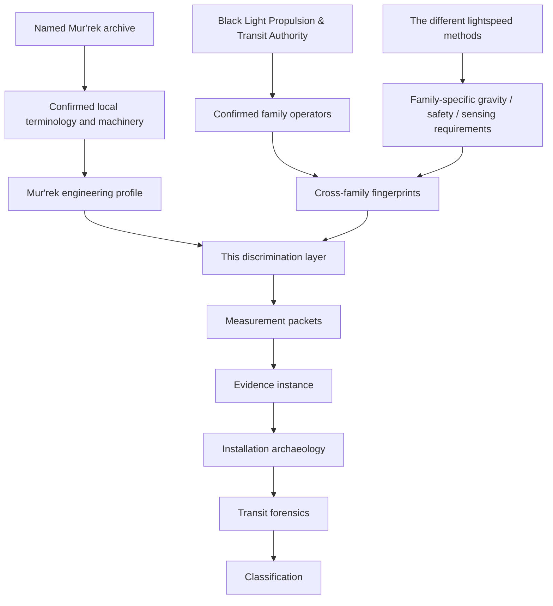
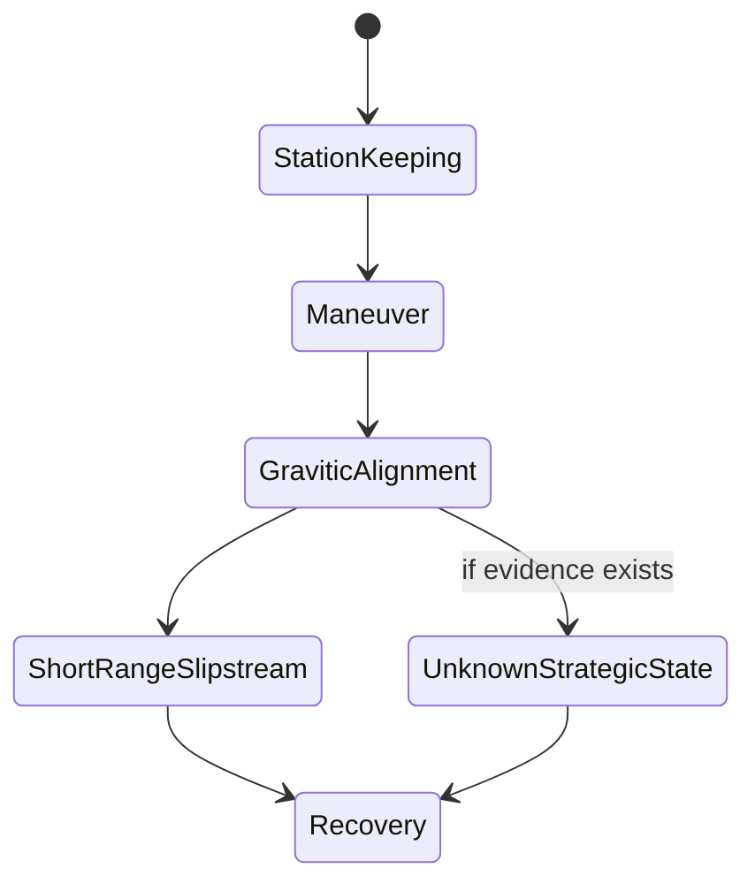

# Zwlei Mur'rek Transit Discrimination & Test Manual

**Status:** MIXED. CONFIRMED Mur'rek installation facts plus DERIVED discrimination, measurement, safety, maintenance, educational, and test doctrine. PROPOSED material is labeled where introduced.  
**Subject:** Mur'rek-class patrol frigate, Zwlei Frog Men.  
**Named-source term:** **bio-reactive gravitic slipstream system**.  
**Consolidated Black Light family:** **UNRESOLVED**.  
**Design source:** Google Drive — *The different lightspeed methods*, document `1e0Xp71EFubBZgXWjjvPxAqPoJIZNwqS6nu1-r7Kil7Y`, revision `ANLCKQllC5h6dLaX5H1RpK8aUFVWsi-IV7gbMHUd0Qq7mIe5uGsLFi5_Hrsr8B6dl8t_ezB0fTSygxrnIBtifAHW79bgSbswp1zF3NaEil0`.

---

## 1. Purpose

The surviving Mur'rek material gives us something unusually useful and unusually dangerous: a named propulsion/transit installation whose local vocabulary overlaps two different consolidated Black Light FTL families.

The source confirms:

- a **bio-reactive gravitic slipstream system**;
- a **Gravitic Slipstream Regulator**;
- flexible field vanes immersed in dielectric fluid;
- shaping of inertial and gravitic conditions;
- short-range slipstream operation;
- a **Navigation Current Well** providing gravitic reference, slipstream prediction, and inertial control;
- gravitic and exotic sensing;
- asymmetric vane response capable of rotating the local inertial frame.

What it does **not** confirm is whether `gravitic slipstream` maps to:

- the consolidated **Hyperspatial Slipstream Shear** family;
- the consolidated **Gravitational-Plane Skimmer** family;
- a hybrid installation in which gravitic/inertial conditioning supports some other transit operator;
- a local or transitional maneuver effect whose source-local name includes `slipstream` but is not itself the vessel's strategic FTL operator.

This manual exists to make that distinction investigable.

The governing principle is:

\[
\boxed{\text{source wording is evidence} \neq \text{family assignment}}
\]

A family label must be earned by operator-level evidence.

---

## 2. Authority chain



The discrimination layer is subordinate to named canon. If a later authoritative record states that the Mur'rek uses a specific family, that record wins within its scope.

Until then:

\[
F_{Mur'rek}=\mathrm{UNRESOLVED}
\]

---

## 3. Why keyword matching fails

The two dangerous shortcuts are obvious:

```text
"slipstream" -> therefore slipstream-shear
"gravitic"   -> therefore gravitic-plane
```

Both are invalid.

A machine can use gravitic control without its transit operator being a gravitational-plane rider. A machine can use the word *slipstream* locally without satisfying the physics of the consolidated Hyperspatial Slipstream Shear family.

The resolver therefore separates three layers:

```text
SOURCE TERM
    ↓
OBSERVED PHYSICAL OPERATOR
    ↓
CONSOLIDATED FAMILY MAPPING
```

Only the second layer can justify the third.

---

## 4. Current candidate set

### H1 — Slipstream operator with gravitic control

**Status:** DERIVED hypothesis.

The prime transit operator is Hyperspatial Slipstream Shear. Gravitic and inertial shaping are acquisition, stabilization, local steering, entry-conditioning, or structural-support functions.

Expected discriminators include:

- a measurable boundary-layer state distinct from ordinary gravitational alignment;
- adhesion/coupling sectors or their functional equivalent;
- detach/recovery reserve;
- route telemetry that describes wake, shear weather, or medium conditions;
- a state transition between gravitic alignment and entry into the transit condition.

### H2 — Gravitational-plane operator with local slipstream terminology

**Status:** DERIVED hypothesis.

The transit operator is Gravitational-Plane Skimmer. `Slipstream` is the Zwlei or translated local term for motion along a gravitationally favorable route structure.

Expected discriminators include:

- route solutions keyed directly to gravitational shear planes, focal nodes, equipotentials, gradients, and branch/fork geometry;
- drive response correlated with those structures even when no separate boundary state is present;
- recoupling or plane-exit logic rather than medium detachment;
- dominant hazard treatment centered on fork divergence, tidal gradients, and differential loading.

### H3 — Hybrid control architecture

**Status:** DERIVED hypothesis.

The Gravitic Slipstream Regulator is a major conditioning/control system but not necessarily the transit prime mover.

Expected discriminators include:

- two separable transition states;
- distinct machinery or reserve networks;
- a second field-former or operator layer;
- telemetry that treats gravitic alignment as a prerequisite rather than the commit state;
- failure isolation that can disable one layer without disabling the other.

### H4 — Local transitional or sub-FTL effect

**Status:** DERIVED hypothesis.

The named short-range slipstream function may be a local maneuver, inertial, or transition effect rather than the vessel's strategic FTL mechanism.

Expected discriminators include:

- no operator-level evidence of superluminal behavior from the regulator itself;
- local-only range/use records;
- strategic transit records that invoke a separate installation, external system, or absent subsystem;
- clear separation between local regulator operation and long-range route planning.

---

## 5. Classification states

```text
UNRESOLVED
    ↓
CANDIDATE_SET
    ↓
PROVISIONAL_FAMILY
    ↓
CONFIRMED_BY_OPERATOR_EVIDENCE

or

CONFIRMED_BY_NAMED_SOURCE
```

The current Mur'rek state is:

\[
\boxed{\mathrm{CANDIDATE\_SET}}
\]

This is more informative than `UNRESOLVED`, but it is **not** a family assignment.

A move to `PROVISIONAL_FAMILY` requires at least two provenance-independent operator-level discriminator groups surviving:

- damage review;
- detectability review;
- covariance review;
- contradiction review;
- source-ancestry review.

A named authoritative source can bypass this evidentiary threshold because it belongs to a higher authority class.

---

## 6. Evidence mathematics

### 6.1 Observation weight

For an observation \(i\):

\[
w_i=r_i d_i p_i s_i
\]

where:

- \(r_i\) = reliability;
- \(d_i\) = damage-adjusted detectability;
- \(p_i\) = provenance independence;
- \(s_i\) = spatial specificity.

Each remains separate in the stored evidence packet.

Do **not** hide them inside one confidence score.

### 6.2 Hypothesis support

For hypothesis \(h\):

\[
S_h=\sum_i w_i l_{ih}-\sum_j w_j c_{jh}
\]

where \(l\) is support and \(c\) contradiction strength.

This is a ranking aid, not a probability that Zwlei history happened one way or another.

### 6.3 Information gain

Test selection can use:

\[
IG(T)=H(H|E)-\mathbb E_o[H(H|E,o)]
\]

where \(H\) is the candidate hypothesis set.

A practical test utility can be written:

\[
U_T=
\frac{IG(T)}
{1+\lambda_h H_T+\lambda_c C_T+\lambda_s S_T+\lambda_d D_T+\lambda_r R_T}
\]

with hazard, contamination, emitted signature, destructive cost, and recovery burden all penalizing the test.

### 6.4 Safe envelope for an unresolved operator

If \(\mathcal A_h\) is the safe active-test envelope under hypothesis \(h\):

\[
\mathcal A_{unknown}
\subseteq
\bigcap_{h\in H_{admissible}} \mathcal A_h
\]

If this intersection is empty, active testing is rejected.

### 6.5 Abort horizon

\[
T_{abort}\ge
 t_{detect}
+t_{validate}
+t_{command}
+t_{actuate}
+t_{decay}
+t_{margin}
\]

If the hazard can become unrecoverable faster than the system can detect and terminate it, the test is inadmissible.

---

## 7. Gravity as a discriminator — but not a shortcut

The design source explicitly requires different transit methods to behave differently around high gravity, distorted spacetime, gravitational lensing volumes, and shear structures.

For the Mur'rek installation we retain a parameterized model:

\[
C_{g,M}
=
F(
\Phi,
\nabla\Phi,
H(\Phi),
\text{shear},
\Sigma_{sensor},
\Sigma_{model},
A_{vane},
\mu_{medium}
)
\]

where the actual coefficients remain unresolved.

The critical distinction is what the transit operator *does* with that information.

| Observation | Gravitational-Plane interpretation | Slipstream-Shear interpretation | Non-discriminating interpretation |
|---|---|---|---|
| Strong gravimetry | route terrain may be operator-critical | gravity may perturb boundary/weather prediction | ordinary navigation/inertial compensation |
| Shear fork detection | potentially direct route hazard | may be external environmental hazard | collision/tidal safety |
| Gravitic vane shaping | may create/maintain plane coupling | may condition entry or hull state | inertial control only |
| Route efficiency falls near mass | direct operator burden possible | boundary stability/prediction burden possible | generic high-gravity penalty |

Therefore:

\[
\boxed{\text{gravity sensitivity alone is not a family discriminator}}
\]

---

## 8. Proposed route-information discriminator

**Status: PROPOSED analytical method.**

One useful future analysis is to compare how much route choice is explained by gravitational geometry versus an independently reconstructed boundary state.

\[
D_{route}
=
I(R;G|B)
-
I(R;B|G)
\]

where:

- \(R\) = route choice;
- \(G\) = gravitational geometry;
- \(B\) = candidate boundary/shear-medium state.

Interpretation:

- strongly positive values would favor gravity-terrain-dominant route selection;
- strongly negative values would favor boundary-state-dominant route selection;
- values near zero may indicate shared dependence, insufficient data, or a hybrid architecture.

This is not canon physics. It is an engineering analysis method.

---

## 9. Mur'rek instrument stack

The discrimination program should prefer family-neutral tools.

| Instrument class | Primary use | Common trap |
|---|---|---|
| Passive multi-channel field recorder | residual survey | treating a single exotic channel as family proof |
| Gravitimetric gradient array | map \(\nabla\Phi\), tidal tensor, shear | ordinary navigation gravimetry looks impressive but may not be operator-specific |
| Metric/topology residual interferometer | detect deformation/topology residue | damage or structure can create false analogues |
| Service-network tracer | find support/prime-mover separation | physical adjacency is not functional connectivity |
| Clock/reference ancestry analyzer | separate shared reference roots | several displays may be one clock source |
| Chemical/biological residue analyzer | fluid condition and historical states | chemistry describes embodiment, not FTL family |
| Geometry/coverage scanner | vane and field coverage reconstruction | repaired/regrown geometry may differ from historical geometry |
| Low-authority stimulus rig | bounded response measurement | support physics may respond without revealing the prime operator |
| Archive/translation workstation | route and control semantics | translated words must not outrank physical evidence |

---

## 10. Covariance and false independence

The Mur'rek installation is especially vulnerable to correlated evidence because multiple systems appear to share the Navigation Current Well, gravitic references, fluid networks, and sensor fusion.

If three consoles reproduce one Current Well solution, that is one root observation with three descendants.

A useful covariance-aware future classifier is:

\[
S_h \propto \mathbf l_h^T\Sigma_E^{-1}\mathbf e
\]

where \(\Sigma_E\) represents shared error and ancestry structure.

Again, this is **PROPOSED** analytical machinery, not setting law.

---

## 11. Negative evidence

A missing marker is admissible only if the survey could actually have seen it.

Use:

\[
A^- = I V R B S (1-D)
\]

where:

- \(I\) = instrument capability;
- \(V\) = actual volume/route coverage;
- \(R\) = required resolution;
- \(B\) = valid bandwidth/dynamic range;
- \(S\) = marker survivability;
- \(D\) = destructive damage fraction.

If a suspected transit compartment is destroyed, inaccessible, vented, chemically altered, or regrown, failure to find the expected marker is weak evidence.

---

# Part II — Practical equipment and test manuals

## MRTD-01 — Passive Regulator Residual Survey

**Purpose:** identify persistent regulator-local physical signatures without changing the installation.

**Hazard:** LOW.

### Equipment

- passive multi-channel field recorder;
- independent gravimetric gradient array;
- thermal and chemical survey package;
- biological activity monitor;
- spatial-registration package;
- independent clock source.

### Procedure

1. Establish shipwide background before approaching the regulator compartment.
2. Record the exact damage and fluid-isolation state.
3. Survey EM, thermal, gravitic, topology, Q-state, chemical, acoustic, and biological channels.
4. Map signals against individual vane sectors and dielectric volumes.
5. Record saturation, clipping, dead zones, and inaccessible geometry.
6. Repeat using an independent reference clock where practical.
7. Export raw measurements before applying family interpretations.

### Stop conditions

Abort passive proximity work if the installation begins increasing field authority, fluid pressure changes unexpectedly, or hazard instrumentation saturates.

### Interpretation

A gravity residual can show that the regulator interacts with local gravity. It cannot by itself prove the Gravitational-Plane family.

A Q-like residual can show a nonclassical or exotic state. It cannot by itself prove Slipstream-Shear.

---

## MRTD-02 — Service-Network & Reserve Topology Trace

**Purpose:** determine whether the regulator is the terminal transit operator or a support layer.

**Hazard:** LOW TO MODERATE.

### Trace separately

- electrical/bio-reactive power;
- conductive coolant;
- dielectric fluid;
- nutrient medium;
- hydraulics;
- data;
- timing/reference;
- field/control routes;
- structural load paths;
- protected recovery reserves.

### Key question

```text
REGULATOR
   │
   ├── terminal field-former / prime mover ?
   │
   └── conditioning/control layer -> SECOND OPERATOR ?
```

Unknown branches remain unknown.

Do not populate inaccessible compartments with a hypothetical drive simply because H3 requires one.

---

## MRTD-03 — Gravity-Terrain Correlation Audit

**Purpose:** determine whether historical route choice is governed by gravitational geometry at an operator level.

**Hazard:** LOW; offline analysis.

### Reconstruct

- stellar and planetary gravitational potential;
- dominant gradients;
- tidal tensor;
- local shear structures;
- focal-node candidates;
- recorded vessel route;
- Current Well state;
- regulator state;
- sensor uncertainty.

### Strong evidence

A strong result is not merely `the ship looked at gravity`.

A stronger result would be:

> the admissible transit path changes discontinuously when a gravitational branch/fork changes, and the regulator/control system follows that branch geometry even after controlling for ordinary collision and navigation requirements.

---

## MRTD-04 — Boundary-State / Shear-Wake Archive Audit

**Purpose:** search for a transit-medium state distinct from gravitational alignment.

**Hazard:** LOW; offline analysis.

Look for:

- entry state;
- boundary acquisition;
- adhesion or coupling state;
- wake history;
- boundary weather;
- detach state;
- protected detach reserve;
- route predictions conditioned on prior traffic or medium condition.

A translated occurrence of *slipstream* is not enough.

The evidence must reveal a physical state or operator behavior.

---

## MRTD-05 — Low-Authority Vane Response

**Purpose:** characterize vane physics without entering any known transit commit state.

**Hazard:** MODERATE.

### Preconditions

- passive survey complete;
- fluid chemistry certified;
- vane geometry surveyed;
- safe-envelope intersection non-empty;
- independent abort power available;
- hazard channels unsaturated;
- recovery reserve protected.

### Derived vane metric

\[
\epsilon_v=
\|\mathbf u_{commanded}-\mathbf u_{observed}\|_W
\]

If \(\epsilon_v\) exceeds the validated test bound, authority is reduced or terminated.

### Hard aborts

- unexpected whole-vessel topology change;
- unexpected Q-state transition;
- loss of independent gravitic reference;
- protected recovery margin violation;
- field growth after command removal;
- fluid isolation fault;
- hazard observability loss.

---

## MRTD-06 — Controlled Gravity-Gradient Response

**Status:** PROPOSED test facility/procedure.

**Purpose:** determine whether regulator behavior has branch/fork-sensitive physics beyond ordinary inertial compensation.

**Hazard:** MODERATE TO HIGH.

This should ideally occur in an external test frame or simulator where no vessel-scale transit commit is possible.

### Observe

- vane authority versus imposed \(\nabla\Phi\);
- response to controlled shear;
- Current Well representation;
- local inertial-frame rotation;
- recoupling-like recovery;
- structural differential loads.

The test supports H2 only if the response is operator-specific and cannot be explained as generic gravitic stabilization.

---

## MRTD-07 — Prime-Mover Separation Audit

**Purpose:** identify whether `short-range slipstream` and strategic transit are the same state machine.

Build a state graph from surviving controls and telemetry:



The `UnknownStrategicState` node must not be created unless evidence supports it.

---

## MRTD-08 — Range & Mission Provenance Audit

**Purpose:** prevent mission geography from becoming fake performance canon.

For every translated range or voyage claim record:

- source block;
- translation confidence;
- clock/reference frame;
- units mapping;
- whether the number is commanded, achieved, planned, or theoretical;
- whether external infrastructure participated;
- whether the claim refers to the regulator or another system.

Do not infer FTL family from the simple fact that a patrol frigate traveled between stars.

---

# Part III — Power, control, maintenance, scaling, and signatures

## 12. Power is multidimensional

The Mur'rek architecture already confirms coupled working media. A useful readiness expression remains:

\[
R_P=
\min\left(
\frac{P_{bio}}{P_{req}},
\frac{Q_{cool}}{Q_{req}},
\frac{H_{hyd}}{H_{req}},
\frac{N_{met}}{N_{req}},
\frac{D_{iel}}{D_{req}}
\right)
\]

The dielectric term is added here as a **DERIVED** test/readiness extension because the field vanes are confirmed to operate immersed in dielectric fluid.

A surplus of power does not rescue:

- dielectric breakdown;
- vane asymmetry;
- failed cooling;
- lost hydraulics;
- bad gravitic reference;
- insufficient sensing lookahead.

---

## 13. Protected recovery authority

Every active test must preserve a family-neutral survival reserve until the family is known.

\[
R_{test}=R_{total}-R_{protected}>0
\]

`R_protected` is not assumed to mean the same physical thing under every hypothesis.

It may eventually resolve as:

- detachment reserve;
- recoupling authority;
- field unwind;
- rejection capacity;
- closure authority;
- state reconciliation;
- local inertial recovery.

Until then it is simply **untouchable recovery capacity**.

---

## 14. Maintenance doctrine

Mur'rek maintenance must treat geometry, fluid condition, reference alignment, and biological state as separate certification domains.

```text
living repair / regrowth
        ↓
material integrity restored
        ≠
field geometry certified
        ≠
reference alignment certified
        ≠
transit readiness certified
```

The standing invariant remains:

\[
\boxed{\text{healed} \neq \text{recertified}}
\]

A regrown vane membrane may be healthy biological material while still being the wrong geometry for the last valid calibration.

---

## 15. Signature model

Use a channel vector, not one stealth percentage:

\[
\mathbf S_M=
[
S_{EM},
S_{thermal},
S_{grav},
S_Q,
S_{topology},
S_{chem},
S_{acoustic},
S_{subspace},
S_{wake},
S_{bio}
]^T
\]

Confirmed low-signature cruise does not prove low-signature transit.

A family resolution may eventually add distinctive wake, boundary, topology, or gravity signatures, but those remain unresolved today.

---

## 16. Failure interactions

### Vane asymmetry

```text
vane-state divergence
       ↓
local inertial-frame rotation
       ↓
Current Well / sensor disagreement
       ↓
control-authority reduction
       ↓
isolation / abort
```

### Fluid contamination

```text
cross-contamination
       ↓
corrosive electrically active foam
       ↓
field / electrical / hydraulic coupling fault
       ↓
sector isolation
       ↓
reduced transit envelope
```

### Sensor loss

```text
Forward Sensor Ampulla damage
       ↓
reduced lookahead
       ↓
smaller admissible prediction horizon
       ↓
lower safe authority
```

This aligns directly with the design-source rule that better transit technology requires sensing and safety systems capable of looking sufficiently far ahead to detect catastrophic route conditions.

---

## 17. Scaling behavior

The Mur'rek installation should continue to use a nonlinear scaling model:

\[
B_M=
F(
A_{vane},
V_{protected},
L_{reference},
Q_{fluid},
M_{ship},
\tau_{response},
\sigma_{alignment},
\mathcal G_{env}
)
\]

For discrimination work, scale introduces additional ambiguity:

- a short-range regulator on a patrol frigate may not represent larger Zwlei systems;
- a field-vane sector may be one part of a distributed ship-scale operator;
- some family markers may only become obvious above a particular physical size or authority;
- damaged sections may preferentially erase large-baseline sensors and make the surviving installation look more local than it originally was.

Never derive civilization-wide scale limits from one frigate.

---

# Part IV — Educational corpus

## 18. Technician primer: observation before interpretation

A technician should be able to answer these in order:

1. What did the instrument measure?
2. Where was it measured?
3. At what damage and intervention epoch?
4. Which calibration and clock produced the value?
5. What other readings share that ancestry?
6. Was the predicted marker actually detectable?
7. What engineering interpretations are compatible with the measurement?
8. Which interpretations are family-discriminating?
9. Which conclusions remain unresolved?

The wrong order is:

> “It says slipstream, so prove that it is Slipstream.”

---

## 19. Undergraduate problem set

### Problem 1 — False independence

Three Current Well displays and one bridge tactical basin show the same route discontinuity.

All four descend from one gravitic-reference solution.

**Question:** how many independent operator-level evidence groups exist?

**Answer:** one, unless an independently sourced measurement validates the discontinuity.

### Problem 2 — Missing boundary marker

A Q-boundary survey returns no signal after the regulator compartment has suffered severe thermal damage and dielectric-fluid loss.

**Question:** can H1 be eliminated?

**Answer:** no. Marker survivability and detectability are compromised.

### Problem 3 — Gravity correlation

Historical transit efficiency falls near a massive planet.

**Question:** does that prove H2?

**Answer:** no. The design source expects all methods to suffer some high-gravity burden. Operator-specific dependence is required.

### Problem 4 — Vane rotation

A low-authority test rotates the local inertial frame by a measurable amount.

**Question:** which family is proven?

**Answer:** none. It confirms a regulator behavior already consistent with named Mur'rek machinery.

---

## 20. Advanced seminar: inverse problems in alien propulsion

The Mur'rek case is an inverse problem:

\[
y=H_h(x)+n+b+c
\]

We observe \(y\), but both the underlying state \(x\) and operator model \(H_h\) may be uncertain.

The difficulty is amplified because:

- damage changes the machine;
- the machine may have repaired itself biologically;
- translated terminology is not a one-to-one map to human/Black Light technical categories;
- multiple candidate operators share gravimetry, exotic sensing, distributed fields, and route prediction;
- measurements share common references.

The correct output is therefore frequently a bounded candidate set, not a single answer.

---

## 21. Thesis directions

The following are **PROPOSED research programs**, not recovered Zwlei history.

### Thesis A — Gravitic/boundary causal separation

Develop a method to separate route dependence on gravity geometry from route dependence on a hypothetical transit-boundary state under correlated sensors.

### Thesis B — Wet-machine field-vane metrology

Quantify how dielectric chemistry, membrane compliance, hydraulic pressure, and biological repair affect field-vane calibration.

### Thesis C — Current Well semantic reconstruction

Determine whether moving-current representations encode operator physics directly or present a species-optimized abstraction over a deeper navigation state.

### Thesis D — Damage-aware alien FTL classification

Build classifiers that preserve uncertainty when the very markers used for classification are preferentially destroyed by drive accidents.

---

## 22. Proposed patent classes

All entries in this section are **PROPOSED** and must not be attributed retroactively to the Zwlei.

### P-MR-01 — Independent Vane Metrology Membrane

A self-contained local geometry/reference layer capable of comparing commanded and actual vane state without relying on the Navigation Current Well.

### P-MR-02 — Dual-Root Gravitic Guard

An independent gravitic hazard sensor with separate clock, calibration, and power ancestry for abort validation.

### P-MR-03 — Fluid-Chemistry Transit Interlock

A gate that prevents high-authority field operation when dielectric, coolant, hydraulic, or bio-reactive media leave certified composition bounds.

### P-MR-04 — Provenance-Aware Current Well Overlay

A diagnostic display that visually separates direct sensor observations, shared-reference descendants, model predictions, and translated archive material.

---

# Part V — API and generator integration

## 23. Resolver

The machine-readable companion defines:

`resolveZwleiMurrekTransitDiscrimination(context)`

### Inputs

- Mur'rek engineering profile;
- measurement packets;
- evidence instance;
- installation graph;
- damage model;
- source snapshot;
- authority mode.

### Outputs

- classification state;
- admissible hypotheses;
- ranked hypotheses;
- operator discriminators;
- contradictions;
- covariance warnings;
- next tests;
- hazard envelope;
- evidence exports;
- provenance graph;
- canon warnings.

The resolver has no automatic promotion authority.

---

## 24. Authority modes

### `AUTHORITY_ONLY`

Emit confirmed source facts and preserve family `UNRESOLVED`.

### `LABELED_DERIVATION`

May derive tests, rankings, failure propagation, safe envelopes, measurement strategies, and engineering implications.

### `LABELED_PROPOSAL`

May propose new test rigs, educational material, research programs, patents, refits, and future machinery concepts.

No mode may invent a historical family assignment.

---

## 25. Evidence packet format

Every test/export should preserve at minimum:

```json
{
  "caseId": "...",
  "eventId": "...",
  "epochId": "...",
  "observationChannel": "GRAVIMETRY",
  "instrumentInstance": "...",
  "calibrationAncestry": ["..."],
  "spatialRegistration": {"compartment": "..."},
  "damageState": "...",
  "detectability": 0.0,
  "covarianceGroup": "...",
  "provenanceRoots": ["..."],
  "rawObservation": {},
  "derivedInterpretation": [],
  "status": "CONFIRMED"
}
```

The raw observation and its interpretation remain separate.

---

## 26. Narrative-safe disclosure

The generator may write:

> The immersed vane bank produces a measurable gravitic gradient and a short-lived exotic residual after the low-authority pulse. The two effects share a command epoch, but the residual's physical role remains unresolved.

It may **not** write:

> The Slipstream drive activates.

unless the family mapping has actually been authorized.

Likewise it may write:

> The Current Well bends its projected route around a branching shear structure.

It may not silently rewrite that observation as:

> The ship locks onto a Gravitational-Plane hyperlane.

Observation comes first.

---

## 27. Canon safeguards

The following are hard rules:

1. Do not normalize `gravitic slipstream` by keyword.
2. Do not infer interstellar range from `short-range slipstream operation`.
3. Do not treat gravitic sensing as a family discriminator unless it is linked to the operator.
4. Do not treat Q-state or topology residue as proof without operator linkage.
5. Do not count shared Current Well, clock, calibration, sensor, archive, or translation descendants as independent evidence.
6. Do not use missing markers to eliminate a family without detectability proof.
7. Do not energize unknown machinery beyond a reversible common safe envelope for classification convenience.
8. Do not invent manufacturers, inventors, dates, Path levels, T-tiers, ranges, beacons, or infrastructure.
9. Do not turn DERIVED equations into universal Black Light constants.
10. Do not let generated prose reveal a family conclusion before the authority resolver does.
11. Preserve contradictions rather than averaging them away.
12. Preserve `UNRESOLVED` when evidence is insufficient.
13. A higher-authority named source overrides this manual where it directly establishes the disputed fact.

---

## 28. Current engineering conclusion

The correct current statement is:

\[
\boxed{
\text{Mur'rek bio-reactive gravitic slipstream installation: CONFIRMED}
}
\]

\[
\boxed{
\text{Mapping to a consolidated Black Light FTL family: UNRESOLVED}
}
\]

The project now has a disciplined route from one statement to the other.

The answer can eventually become `slipstream-shear`, `gravitic-plane`, a hybrid interpretation, a local transitional system, or some later canon-defined mapping—but only when the evidence actually earns it.
