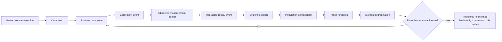
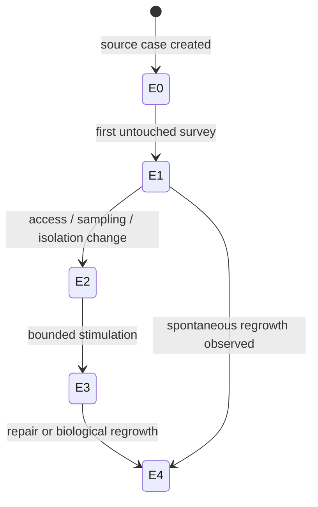
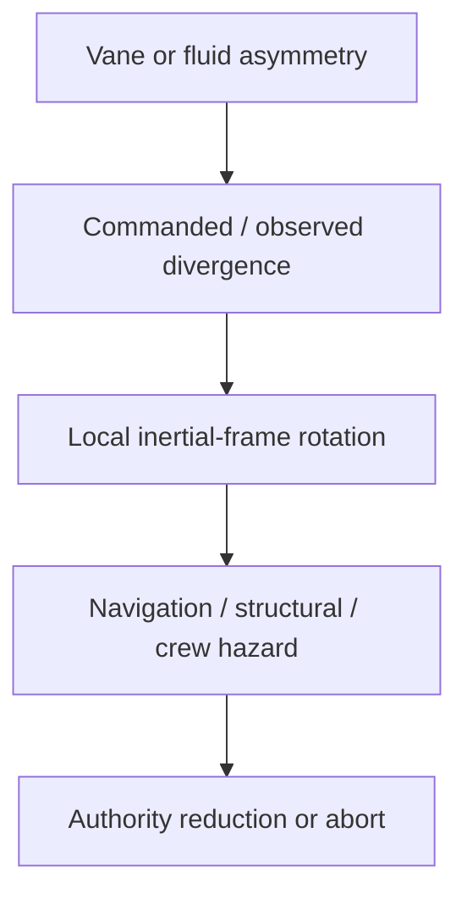
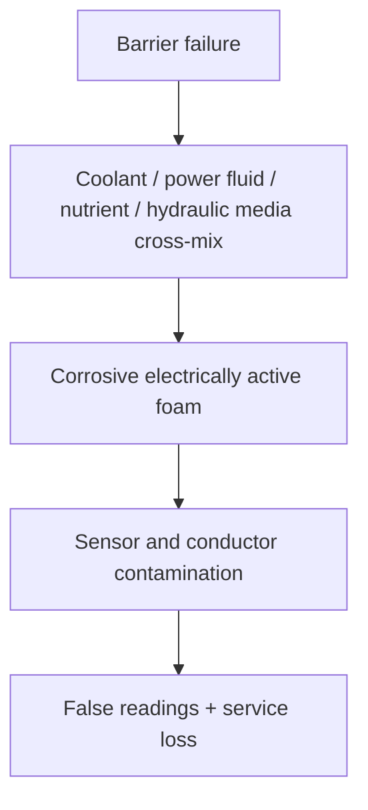

# Zwlei Mur'rek Transit Runtime Survey Operations Manual

**Status:** `MIXED` — CONFIRMED named Mur'rek facts, DERIVED survey/replay engineering, and explicitly PROPOSED analytical extensions.  
**Scope:** executable investigation bridge for the No Return Signal Mur'rek derelict. This manual does not identify the vessel's consolidated FTL family.  
**Primary design source:** *The different lightspeed methods*, Google Drive document `1e0Xp71EFubBZgXWjjvPxAqPoJIZNwqS6nu1-r7Kil7Y`.  
**Named-source basis:** `blacklight-archive-zwlei-murrek-no-return-signal-derelict.html`.  
**Runtime dependencies:** `blacklight-exo-ftl-event-replay-runtime.js` and `blacklight-exo-zwlei-murrek-transit-case-runtime.js`.  
**Machine contracts:** `data/exo-vessel/zwlei-murrek-transit-case-seed.json` and `data/exo-vessel/zwlei-murrek-transit-case-runtime-contract.json`.

---

## 1. Purpose

The project already knows, from named source material, that a Mur'rek-class patrol frigate uses a bio-reactive gravitic slipstream system; that the Gravitic Slipstream Regulator uses flexible field vanes immersed in dielectric fluid; that the Navigation Current Well provides gravitic reference, slipstream prediction, and inertial control; and that asymmetric vane response can rotate the local inertial frame.

Those are source assertions. They are not measurements of the ruined No Return Signal vessel.

This manual defines how source facts become a live investigation without crossing that boundary.



The governing rule is:

\[
\boxed{\text{archive fact} \neq \text{field measurement} \neq \text{derived interpretation}}
\]

The runtime exists to make that distinction difficult to violate accidentally.

---

## 2. Authority and provenance

When records disagree, use this order within the Mur'rek transit case:

1. Specific named Mur'rek vessel, class, compartment, or machinery source.
2. Specific confirmed operator-level evidence recovered from the case.
3. `BLACK_LIGHT_PROPULSION_TRANSIT_AUTHORITY.md`.
4. `zwlei-murrek-transit-engineering-registry.json`.
5. `zwlei-murrek-transit-discrimination-registry.json`.
6. `zwlei-murrek-transit-case-seed.json`.
7. Generic measurement, event replay, evidence, archaeology, and forensic authorities.
8. Labeled derivation.
9. Labeled proposal.

The runtime is below named canon. It can organize evidence but cannot overrule the source.

```text
The different lightspeed methods
        ↓ design constraints
named Mur'rek archive
        ↓ vessel/class facts
Mur'rek engineering profile
        ↓ machinery embodiment
Mur'rek discrimination registry
        ↓ candidate hypotheses
Mur'rek case seed
        ↓ source/observation separation
Mur'rek runtime adapter
        ↓ typed replay events
Generic FTL replay runtime
        ↓ immutable evidence history
Evidence / archaeology / forensics
        ↓ operator-level conclusions
Mur'rek family discrimination
```

Every downstream object must remain traceable upward. No generated observation may appear without an instrument, compartment, event, caller-supplied timestamp, and provenance roots.

---

## 3. Case states and physical epochs

The runtime maps descriptive case epochs onto monotonic integer epochs required by deterministic replay.

| Label | Runtime epoch | Meaning |
|---|---:|---|
| `E0_ARCHIVE_BASELINE` | 0 | Source-only state. No physical survey asserted. |
| `E1_UNTOUCHED_PHYSICAL_SURVEY` | 1 | Passive observations before access, sampling, or energization changes the wreck. |
| `E2_POST_ACCESS_STATE` | 2 | State after doors, membranes, service boundaries, atmosphere, samples, or isolation have been changed. |
| `E3_POST_STIMULATION_STATE` | 3 | State after bounded energization or low-authority tests. |
| `E4_POST_REPAIR_OR_REGROWTH` | 4 | State after repair, autonomous healing, biological regrowth, or geometry-changing intervention. |



A later epoch does not erase earlier evidence. A new event is appended.

---

## 4. Runtime API

The runtime entrypoint is `blacklight-exo-zwlei-murrek-transit-case-runtime.js`; it depends on `blacklight-exo-ftl-event-replay-runtime.js`.

| Function | Purpose |
|---|---|
| `createMurrekInitialState(seed)` | Convert the case seed into generic replay state without claiming a physical measurement occurred. |
| `buildCaseInitializationEvent(seed, meta)` | Build `MRK-E000`; refuses to invent a record timestamp. |
| `initializeMurrekCase(seed, meta)` | Append the case-initialization event when the caller supplies `recordedAt`. |
| `validateMeasurementPacket(packet)` | Reject placeholders, missing provenance, missing calibration, empty values, and incomplete observation records. |
| `appendMeasurement(state, packet, authoritySnapshot)` | Convert an actual observed packet into a generic `PASSIVE_MEASUREMENT` replay event. |
| `appendCalibration(state, record, authoritySnapshot)` | Record case-specific calibration ancestry before measurement admission. |
| `passiveSurveyAdmission(state)` | Determine whether a real physical survey state exists. |
| `lowAuthorityTestAdmission(state, context)` | Evaluate all active-test safety gates without filling unknowns optimistically. |
| `deriveDiscriminationInput(state)` | Produce Mur'rek hypothesis inputs while keeping family unresolved. |
| `exportMurrekEvidence(state, options)` | Export evidence into the downstream FTL forensic chain. |

The runtime refuses to invent investigation timestamps. If `recordedAt` is absent during initialization, it returns a non-executable proposal. If `observedAt` is absent from a measurement, the packet is rejected.

---

## 5. Measurement packet contract

`MRK-M000` is reserved as an explicit *absence of measurements* placeholder. It can never enter the evidence ledger. Real observations begin at `MRK-M001`.

A measurement packet must provide at least:

```text
packetId
observed = true
instrumentId
compartmentId
channel
values {}
uncertainty {}
calibrationRef
provenanceRoots []
observedAt
epoch
```

The packet records what was observed, not what somebody hopes it means.

The generic measurement model remains:

\[
\mathbf y = H(\mathbf x)+\mathbf b+\mathbf n+\mathbf c
\]

with physical response, calibrated bias, stochastic noise, and contamination/unmodelled coupling retained separately.

Uncertainty remains decomposed:

\[
\mathcal U=
\{\Sigma_{random},\Sigma_{cal},\Sigma_{clock},\Sigma_{reg},\Sigma_{damage},\Sigma_{model},\Sigma_{contam}\}.
\]

A single confidence percentage is not an adequate substitute.

---

## 6. Mur'rek survey instruments

The case seed defines investigator-owned equipment rather than pretending the derelict provides trustworthy instruments.

| ID | Instrument | Primary role | Family-selection authority |
|---|---|---|---|
| `MRK-I01` | passive multi-channel field recorder | synchronized baseline channels | none |
| `MRK-I02` | gravimetric gradient array | gravity, tidal, vane-response geometry | none |
| `MRK-I03` | service-network tracer | network topology without prime-mover energization | none |
| `MRK-I04` | clock/reference ancestry analyzer | covariance and common-root detection | none |
| `MRK-I05` | chemical-biological residue analyzer | dielectric, power-fluid, coolant, nutrient, repair tissue | none |
| `MRK-I06` | low-authority stimulus-and-response rig | bounded active tests after admission | none |

Calibration should establish identifier, timestamp, external reference, dynamic range, resolution, saturation behavior, reference ancestry, environmental correction, and provenance roots.

A calibration made after corrosive fluid exposure cannot be back-applied blindly to an earlier untouched survey.

---

## 7. Negative evidence

A missing signal is useful only when the signal should have been observable.

\[
A^- = I\,V\,R\,B\,S\,(1-D)
\]

where instrument capability, coverage, resolution, bandwidth/dynamic range, marker survivability, and damage all matter.

Therefore:

\[
\boxed{\text{NOT OBSERVED}\neq 0}
\]

\[
\boxed{\text{below resolution}\neq 0}
\]

\[
\boxed{\text{saturated}\neq \text{negative detection}}
\]

\[
\boxed{\text{destroyed sensor}\neq \text{negative detection}}
\]

This is particularly important because the Forward Sensor Ampulla is source-confirmed as comparatively fragile.

---

## 8. Covariance and false independence

Mur'rek interfaces are vulnerable to false independence because several displays or transducers may share one Navigation Current Well, one gravitic reference, one sensor-fusion root, one clock, one fluid source, or one translated archive block.

If observations \(i\) and \(j\) share a root,

\[
\operatorname{Cov}(e_i,e_j)\neq0
\]

must be assumed until independence is demonstrated.

A PROPOSED downstream form is:

\[
S_h \propto \mathbf l_h^T \Sigma_E^{-1}\mathbf e.
\]

This is an analytical aid, not retroactive setting canon.

---

## 9. Passive and active admission

Passive survey admission requires at least one case-certified calibration, entry into `E1_UNTOUCHED_PHYSICAL_SURVEY`, and at least one `observed=true` packet. Admission means only that physical evidence exists.

Unknown-family machinery is tested only inside the common safe envelope of every still-admissible hypothesis:

\[
\mathcal A_{unknown}
\subseteq
\bigcap_{h\in H_{admissible}}\mathcal A_h.
\]

Active testing requires all of these gates:

| Gate | Purpose |
|---|---|
| passive baseline complete | preserve pre-intervention evidence |
| vane geometry surveyed | avoid energizing malformed field surfaces |
| dielectric and vital-fluid hazards bounded | wet systems can be chemically/electrically hazardous |
| independent abort authority | derelict controls are not trusted as sole emergency authority |
| common safe envelope non-empty | unresolved operator remains protected |
| protected recovery reserve excluded | experimentation cannot consume the final recovery path |
| hazard observability maintained | invisible hazard growth requires abort |

Any false or unknown gate rejects active testing.

---

## 10. Abort model

Abortability is a timing proof:

\[
T_{abort}
\ge
 t_{detect}+t_{validate}+t_{command}+t_{actuate}+t_{decay}+t_{margin}.
\]

A proposed vane-control residual is:

\[
\epsilon_v=\|\mathbf u_{commanded}-\mathbf u_{observed}\|_W.
\]

No universal \(\epsilon_{abort}\) is canonized.

The operational invariant is:

\[
\boxed{\text{loss of hazard observability}\Rightarrow\text{abort}}
\]

unless an independently validated guard channel survives.

---

## 11. Power, support, navigation, and service topology

The wet architecture requires more than an energy percentage:

\[
R_P=
\min\left(
\frac{P_{bio}}{P_{req}},
\frac{Q_{cool}}{Q_{req}},
\frac{H_{hyd}}{H_{req}},
\frac{N_{met}}{N_{req}},
\frac{D_{diel}}{D_{req}}
\right).
\]

A full bio-reactive reservoir cannot compensate for failed dielectric condition, coolant, hydraulic control, nutrient support, or vane geometry.

The installation should be reconstructed as a multiplex graph:

\[
G_M=(V,E_P,E_D,E_C,E_N,E_H,E_{data},E_t,E_F,E_S,E_R).
\]

Room adjacency is not an engineering edge.

The Navigation Current Well's source-confirmed moving-current representation can be treated as a DERIVED interface transform:

\[
\mathcal C:\mathbf x_{nav}\rightarrow\{v_c,d_c,I_c\}.
\]

The exact encoding remains unresolved.

The design source requires a crucial distinction:

\[
\boxed{\text{gravity awareness}\neq\text{gravitational-plane identification}}
\]

All families can suffer gravity-related penalties. The discriminator is whether gravity geometry is actually the route operator.

A PROPOSED route discriminator is:

\[
D_{route}=I(R;G|B)-I(R;B|G)
\]

with route choice \(R\), gravitational geometry \(G\), and candidate boundary/shear state \(B\).

---

## 12. Signature, failure, maintenance, and scale

A future observed signature may populate:

\[
\mathbf S_M=
[S_{EM},S_{thermal},S_{grav},S_Q,S_{topology},S_{chem},S_{acoustic},S_{subspace},S_{wake},S_{bio}]^T.
\]

Low-signature cruise does not mean invisible FTL.

Confirmed vane-asymmetry behavior is represented as:



Confirmed wet-system cross-mixing is represented as:



Maintenance has separate biological, geometric, chemical, hydraulic, gravitic-reference, timing, field-symmetry, and structural certification domains. Therefore:

\[
\boxed{\text{healed}\neq\text{recertified}}
\]

Until the family is resolved, scale remains parameterized:

\[
B_M=F(A_{vane},V_{protected},L_{reference},Q_{fluid},M_{ship},\tau_{response},\sigma_{alignment},\mathcal G_{env}).
\]

No numeric Mur'rek coefficient is presently canon.

The design source's safety-lookahead requirement remains:

\[
L_{safe}\ge v_{effective}T_{avoid}+L_{model}+L_{margin}.
\]

Greater transit authority demands greater predictive authority, never perfect safety.

---

## 13. Hypothesis export and promotion

The runtime exports four existing candidate interpretations without promoting any of them:

| ID | Interpretation |
|---|---|
| H1 | Slipstream operator with gravitic control |
| H2 | Gravitational-plane operator using local `slipstream` terminology |
| H3 | Hybrid regulator/control architecture feeding another operator |
| H4 | Local transitional/sub-FTL regulator; strategic FTL remains unidentified |

Absent a higher-authority named source:

\[
\text{PROVISIONAL FAMILY}
\Leftarrow
N_{independent\ operator\ groups}\ge2
\]

and those groups must survive damage, detectability, covariance, contradiction, and provenance review.

---

## 14. Practical procedures

### MRRT-01 — Initialize the runtime case

Load the case seed, verify `consolidatedFamily=UNRESOLVED` and `familyAutoSelection=false`, create initial replay state, supply a real `recordedAt`, append `MRK-E000`, and verify observation count remains zero.

### MRRT-02 — Calibrate an external instrument

Establish an external standard and independent clock, record range/resolution/saturation behavior, create a calibration ID, append the calibration event, and verify the record replays.

### MRRT-03 — Admit the first physical measurement

Remain in `E1_UNTOUCHED_PHYSICAL_SURVEY`; select a known case compartment and calibrated case instrument; record actual values, uncertainty, detectability, damage context, provenance roots, and observation time; assign `MRK-M001+`; append; verify family remains unresolved.

### MRRT-04 — Preserve an absence correctly

Record channel, coverage, resolution, dynamic range, saturation/clipping, marker survivability, and damage. Do not write `value=0` unless zero was actually measured with adequate resolution and range.

### MRRT-05 — Trace service topology

Trace power, dielectric, coolant, nutrient, hydraulic, data, timing, field, structural, and recovery routes without energizing unknown prime movers. Leave inaccessible branches unknown.

### MRRT-06 — Evaluate active-test admission

Call the active-test gate only after real passive measurements exist. All seven safety gates must pass. If one is unknown, reject. If the common safe-envelope intersection is empty, remain passive.

### MRRT-07 — Record an intervention epoch

Before opening, sampling, energizing, repairing, or permitting regrowth to alter the target, close the baseline, append the intervention, advance epoch, reconsider calibration applicability, and preserve earlier evidence unchanged.

### MRRT-08 — Export to discrimination

Replay accepted events, export narrative-safe evidence, build covariance groups, exclude source assertions and `MRK-M000` from measurement counts, pass operator-level discriminators downstream, and apply the promotion rule.

---

## 15. Educational text

### Apprentice exercise: the dangerous zero

A survey instrument saturates during a regulator transient and returns no usable boundary-state value. Is that evidence of no boundary state? No. Saturation destroys detectability; the correct state is unknown for that interval.

### Apprentice exercise: three agreeing displays

Three Current Well displays show the same gravity vector. Is that three independent observations? Not until reference ancestry demonstrates independence.

### Engineering-school exercise: living repair

A vane-support membrane regrows and appears healthy. Can the previous field calibration be reused? No. Geometry-dependent calibration requires recertification.

### Advanced exercise: one gravitic result

A gradient array finds a persistent vane-local gravitic residual, Q-state instruments are below resolution, and route records are damaged. Which family wins? None. The result constrains machinery but does not satisfy operator-level promotion.

---

## 16. Advanced analysis and research

A PROPOSED safe-test utility remains:

\[
U_T=\frac{IG(T)}{1+\lambda_hH_T+\lambda_cC_T+\lambda_sS_T+\lambda_dD_T+\lambda_rR_T}.
\]

Information gain competes with hazard, evidence contamination, emitted signature, destructive cost, and recovery burden.

Pre/post comparison should account for passive wreck evolution:

\[
\Delta y=y_{post}-M(y_{pre},\Delta t,\mathcal E).
\]

Shared-reference covariance can be carried as:

\[
\Sigma_\Delta=
\Sigma_{post}+J_M\Sigma_{pre}J_M^T-2\operatorname{Cov}(post,M(pre)).
\]

PROPOSED research programs include flexible-vane response under dielectric drift, Navigation Current Well cognition, common-mode wet-machine failure, and operator discrimination under wreck damage.

PROPOSED patent-class concepts include an independent gravitic guard ampulla, vane-surface self-metrology membrane, provenance-aware Current Well overlay, and fluid-boundary chromatographic isolation gate. These are design exercises, not historical Zwlei products.

---

## 17. Generator and narrative safeguards

The generator may create empty forms, IDs, calibration requirements, test proposals, event records, compartment references, unknown-state service edges, and explicit uncertainty fields.

It may not fabricate sensor values, times, operator evidence, family assignment, historical manufacturer, inventor, range, speed, or operational status.

Player-facing text may say “a chamber containing flexible immersed vanes,” “a gravitic reference organ,” or “an unknown transit-related field response.” It may not casually name a Slipstream drive, Gravitational-Plane engine, or FTL core before the evidence earns that conclusion.

---

## 18. Current case conclusion

The runtime begins with a source-rich but measurement-empty case:

\[
\boxed{\text{Mur'rek consolidated FTL family}=\mathrm{UNRESOLVED}}
\]

The correct next evidence event is not a guessed family assignment. It is the first real calibration or observed measurement packet produced by an actual scenario, GM decision, recovered telemetry record, or explicitly authored canon source.

This runtime layer makes future discovery cumulative without making present ignorance disappear.